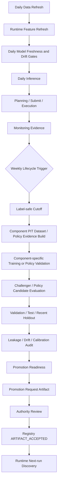

# AI Lifecycle v2 Architecture

## 1. Purpose

AI Lifecycle v2 defines how AI Fund Lab v2 updates trainable AI models without allowing Runtime jobs, training jobs, or scripts to silently promote artifacts into production use.

This document is the formal Single Source of Truth (SoT) for AI lifecycle architecture across AI Fund Lab v2. It is not a Phase17-only report. Future phases must update and reference this document when lifecycle responsibilities, gates, artifact membership, scheduler behavior, monitoring, or rollback semantics change.

Phase reports may record design decisions, review results, and change history for a phase, but the durable AI Lifecycle specification belongs here.

This architecture applies to all current and future AI Fund Lab v2 AI components:

- Candidate AI
- Opportunity AI
- Position Management AI
- Safety AI / Safety Policy Engine
- any future AI component added to the system

New AI components must be added to this document using the component lifecycle format in Section 13 before they can be integrated into Runtime or Registry acceptance.

This contract separates:

- Runtime Data Plane
- Runtime Control Plane
- AI Lifecycle Control Plane
- Artifact Registry
- Operator / Authority
- Monitoring / Alerting

The design follows the Phase17-BV19 audit result:

```text
TRAINING_PIPELINE_PARTIAL
AUTO_RETRAIN_NOT_READY
REGISTRY_PARTIAL
MODEL_LIFECYCLE_INCOMPLETE
DATASET_PIPELINE_BLOCKED
REVIEW_REQUIRED
```

Runtime v2 already resolves accepted AI artifact sets through the Artifact Registry and fails closed on model / metrics / schema mismatches. The missing system is the lifecycle that creates, evaluates, packages, approves, promotes, monitors, and rolls back AI artifacts and policy artifacts across all AI components.

## 2. Lifecycle Overview



Formal policy:

```text
DAILY_INFERENCE
WEEKLY_RETRAIN
```

Daily inference must not depend on weekly retrain success unless the currently accepted Champion violates freshness or drift gates. Weekly retrain may produce promotion requests, but it must not self-promote.

## 2.1 System Objective Alignment

AI Lifecycle v2 is not only a safety and MLOps framework. It must support AI Fund Lab v2's operating objective:

```text
market: Japanese equities
instrument: cash equities only
initial capital: JPY 1,000,000
operator time: minimal
operation: autonomous daily operation
objective: continuous opportunity capture with unnecessary loss suppression
target capital deployment: around 80%
long-term return objective: around +50% annualized
```

The annualized return objective must not be used as a direct single-model promotion PASS/FAIL condition. Opportunity AI, Candidate AI, PM, or Safety must not be forced to BUY in order to hit a capital deployment target.

Lifecycle decisions must satisfy three axes:

```text
Safety
Predictive Validity
Operational Utility
```

Safety-only designs that permanently eliminate trading opportunities are not sufficient. Designs that force BUYs to satisfy utilization targets are prohibited.

Objective responsibility layers:

| Layer | Responsibility | Examples |
| --- | --- | --- |
| Model-level | Predictive quality and usable opportunity signals | ranking, calibration, downside, coverage, positive candidate quality |
| Strategy-level | Trading rule usefulness and cost-adjusted opportunity conversion | BUY/SELL rules, holding horizon, turnover, fees, capital allocation constraints |
| Portfolio-level | Whole-account objective tracking | capital deployment, total return, drawdown, cash, concentration |

The +50% long-term objective belongs to strategy/portfolio evaluation. It informs lifecycle review and roadmap priorities, but it must not override model integrity, leakage, safety, or fail-closed gates.

## 3. Responsibility Boundaries

### 3.1 Runtime Data Plane

Responsibilities:

- daily market data readiness
- daily feature generation
- accepted artifact resolution
- model / metrics / schema hash validation
- daily Candidate / Opportunity inference
- BUY / SELL planning
- Submit / Execution
- Current / Ledger projection
- evidence emission

Runtime Data Plane must not:

- train models
- rebuild training datasets
- fit calibrators
- relax thresholds automatically
- write Registry accepted events
- self-promote artifacts
- mutate training data
- switch model paths by local file edit

Runtime Data Plane can consume only accepted, runtime-use-eligible artifact sets exposed by the Registry.

### 3.2 Runtime Control Plane

Responsibilities:

- daily operation orchestration
- job dependency management
- model age gate
- dataset freshness gate
- prediction drift gate
- positive-rate drift gate
- feature drift gate
- BUY enable / REVIEW_REQUIRED / BLOCK decision
- failure propagation
- lifecycle trigger coordination

Runtime Control Plane may trigger an AI Lifecycle job, but it must treat the lifecycle job as an external control-plane workflow. It must not directly train, approve, or accept a model.

Preferred trigger design:

```text
Runtime Scheduler
  -> daily Runtime jobs
  -> weekly AI lifecycle trigger job
```

The weekly trigger can be implemented as a separate LaunchAgent or scheduler entry that calls an AI lifecycle CLI. The daily Runtime operation must remain able to run while a weekly lifecycle job is training, unless a shared lock says Registry acceptance or artifact packaging is in progress.

### 3.3 AI Lifecycle Control Plane

Responsibilities:

- label-safe cutoff calculation
- component-specific PIT dataset rebuild
- component-specific policy/evidence rebuild for rule-based AI
- dataset data-quality audit
- training for trainable AI
- policy validation for rule-based AI / policy engines
- validation
- test
- recent holdout
- Champion / Challenger comparison
- calibration evaluation
- leakage audit
- drift evaluation
- promotion readiness classification
- artifact packaging
- promotion request creation
- rollback readiness evidence

AI Lifecycle Control Plane must not:

- write `ARTIFACT_ACCEPTED`
- mark runtime_use_eligible by itself
- directly edit Runtime model paths
- relax BUY eligibility
- use broker, ledger, selected/bought, PnL, or portfolio results as training features

### 3.4 Artifact Registry

Responsibilities:

- accepted artifact authority
- artifact set state: `DRAFT`, `VALIDATED`, `ACCEPTED`, `LEGACY`, `REVOKED`, `SUPERSEDED`
- hash verification
- artifact set consistency
- consumer compatibility
- Runtime discovery
- rollback target resolution

Registry does not evaluate model profitability. Registry records authority-approved artifact identity and eligibility after evidence exists.

### 3.5 Operator / Authority

Responsibilities:

- Promotion final approval
- Registry accepted event authorization
- Rollback approval
- Emergency revoke
- BUY re-enable approval
- manual override rejection for prohibited scopes

Manual override is prohibited for:

- model path substitution
- hash mismatch acceptance
- stale training lineage acceptance
- BUY threshold relaxation
- missing validation evidence
- missing consumer compatibility
- missing leakage audit

## 4. Daily Inference Contract

Daily Runtime operation sequence:

```text
market data refresh
feature refresh
artifact resolution
model age gate
dataset freshness gate
drift gate
inference
BUY/SELL planning
submit/execution/current/ledger
monitoring evidence
```

Daily BUY gating:

- accepted model missing: `BUY BLOCK`
- model / metrics / schema mismatch: `HALT`
- training lineage missing: `BUY BLOCK`
- model age violation: `BUY BLOCK`
- dataset freshness violation: `BUY BLOCK`
- hard feature drift violation: `BUY BLOCK`
- prediction all-negative alarm: `REVIEW_REQUIRED`
- accepted model fresh and drift PASS: BUY may continue through BV14/BV15 eligibility

SELL gating is separate. SELL should continue when BUY is blocked by model staleness, unless SELL dependencies such as Current, PM authority, Safety, or Broker availability fail.

## 5. Weekly Retrain Contract

Weekly retrain trigger rule:

```text
Run on the first eligible business day after label-safe data readiness advances enough.
```

The calendar may nominate a fixed weekday, but execution is gated by label-safe readiness:

- label-safe cutoff advanced by at least 5 business dates, or model age warning threshold reached
- minimum new candidate rows available
- source data freshness PASS
- no active Registry acceptance lock
- no overlapping lifecycle run for the same cutoff

Weekly lifecycle outputs:

- dataset artifacts
- training artifacts
- validation/test/recent holdout evidence
- leakage audit
- drift/calibration evidence
- promotion readiness
- promotion request artifact
- rollback metadata

Weekly retrain failure does not automatically stop SELL. BUY continues only if the current Champion still passes model age, dataset freshness, and drift gates.

## 6. Freshness Contract

Required fields:

| Field | Meaning | Authority |
| --- | --- | --- |
| `market_data_max_date` | Latest available market data date | Market data producer |
| `feature_data_max_date` | Latest feature date produced for inference | Feature refresh producer |
| `training_dataset_max_date` | Latest labeled date in training dataset | Dataset builder metadata |
| `label_safe_cutoff` | Latest feature date whose 20bd labels are observable | AI Lifecycle cutoff resolver |
| `model_training_cutoff` | Max target date used by model training | Training metadata |
| `model_created_at` | Model artifact creation time | Training artifact |
| `model_accepted_at` | Registry accepted event time | Registry |
| `model_age_business_days` | Business days from training cutoff or accepted date to decision date | Runtime Control Plane |
| `dataset_age_business_days` | Business days from training dataset max date to decision date | Runtime Control Plane |

Freshness clocks must be separated:

| Clock | Formula / Meaning | Applies To |
| --- | --- | --- |
| `source_data_age_business_days` | `decision_date - market_data_max_date` | market/source readiness |
| `feature_data_age_business_days` | `decision_date - feature_data_max_date` | daily inference readiness |
| `dataset_lag_business_days` | `label_safe_cutoff - training_dataset_max_date` | trainable AI dataset freshness |
| `model_training_lag_business_days` | `label_safe_cutoff - model_training_cutoff` | trainable AI model freshness against label-safe data |
| `model_acceptance_age_business_days` | `decision_date - model_accepted_at` | accepted artifact lifecycle age |

Do not use `decision_date - training_dataset_max_date > target_horizon` as a BUY block by itself. For a 20-business-day target horizon, a healthy latest labeled dataset is expected to lag the decision date by roughly the label horizon. Blocking on that raw difference would double-count the target horizon and could incorrectly stop normal operation.

Each trainable AI must declare:

```text
target_horizon_business_days
label_safe_cutoff_formula
dataset_lag_threshold
model_training_lag_threshold
model_acceptance_age_threshold
```

Candidate AI and Opportunity AI may have different target horizons and therefore require component-specific freshness thresholds. Rule-based Position Management and Safety policy engines must not inherit trainable model age semantics.

Recommended initial thresholds derived from BV17/BV18 for 20bd Opportunity-style labels:

- max `model_training_lag_business_days`: `20` business days
- `model_training_lag_business_days` review threshold: `5` business days
- minimum new training dates before weekly run: `5` business dates
- minimum new candidate rows before weekly run: `250`
- minimum validation window: `40` business dates
- minimum recent holdout window: `20` business dates

BUY gate:

| Condition | Result |
| --- | --- |
| `model_training_lag_business_days > 20bd` | `BUY BLOCK` |
| `dataset_lag_business_days > 20bd` | `BUY BLOCK` |
| `model_training_lag_business_days > 5bd` | `REVIEW_REQUIRED` |
| `source_data_age_business_days` exceeds market freshness policy | `REVIEW_REQUIRED/BLOCK` |
| `feature_data_age_business_days` exceeds inference policy | `BUY BLOCK` |
| missing accepted training lineage | `BUY BLOCK` |
| future-dated training cutoff | `HALT` |

SELL gate:

```text
BUY freshness violations do not block SELL by themselves.
SELL remains governed by Current, PM, Safety, Submit, Broker availability, and position authority.
```

## 7. Drift Contract

Required monitoring metrics:

- feature PSI
- prediction score mean
- prediction positive rate
- top1 score
- all-negative consecutive business days
- candidate population distribution
- recent ranking performance
- calibration error

Statuses:

```text
PASS
REVIEW_REQUIRED
BLOCK
```

Recommended thresholds:

| Metric | REVIEW_REQUIRED | BLOCK |
| --- | --- | --- |
| feature PSI | `> 0.20` | `> 0.30` |
| all-negative predictions | `3` consecutive business days | `5` consecutive business days or with model age warning |
| positive rate | below 25% of baseline for `3` business days | below 10% of baseline for `5` business days |
| top1 score | `<= 0` for `3` business days | `<= 0` for `5` business days with degraded recent ranking |
| score mean | below rolling 20bd mean by more than `2 std` | below threshold plus feature PSI hard breach |
| recent ranking performance | Spearman `<= 0` or top-k mean not positive | recent holdout hard fail for promotion candidate |
| calibration error | exceeds accepted baseline | calibration hard fail for promotion candidate |

Design basis:

- BV16/BV17 observed 10 all-negative Runtime replay days.
- BV18 proposed all-negative alarm after 3 days, PSI review at `>0.20`, halt at `>0.30`, and model max age of 20 business days.

### 7.1 Model Health vs Market State

Runtime and monitoring must distinguish:

```text
MODEL_UNHEALTHY
MARKET_NO_OPPORTUNITY
```

`positive_count = 0` or `top1_score <= 0` alone is not sufficient to classify model failure. It may be a valid weak-market/no-opportunity signal.

State vocabulary:

| State | Meaning | BUY Behavior |
| --- | --- | --- |
| `MODEL_HEALTH_PASS` | artifacts, freshness, drift, and distribution checks pass | continue normal gates |
| `MODEL_HEALTH_REVIEW_REQUIRED` | soft anomaly requires operator/lifecycle review | no forced BUY; may block depending on severity |
| `MODEL_UNHEALTHY` | freshness, hard drift, artifact, schema, or severe distribution failure | `BUY BLOCK` |
| `MARKET_NO_OPPORTUNITY` | model is healthy but current candidates have no positive eligible edge | no BUY, not model failure |
| `MODEL_HEALTH_UNKNOWN` | insufficient evidence to distinguish | `REVIEW_REQUIRED` |

Composite classification:

| Evidence | Classification |
| --- | --- |
| all-negative only, artifacts/freshness/drift PASS | `MARKET_NO_OPPORTUNITY_CANDIDATE` |
| all-negative plus freshness violation | `MODEL_UNHEALTHY`, `BUY BLOCK` |
| all-negative plus hard feature/candidate drift | `MODEL_UNHEALTHY`, `BUY BLOCK` |
| all-negative plus schema/hash/artifact failure | `HALT` or `BUY BLOCK` |
| all-negative plus historical baseline extreme deviation but no hard failure | `MODEL_HEALTH_REVIEW_REQUIRED` |

Required evidence fields:

```text
model_health_status
market_opportunity_status
all_negative_consecutive_business_days
artifact_integrity_status
schema_hash_status
model_freshness_status
dataset_lag_status
feature_drift_status
candidate_population_drift_status
prediction_distribution_status
historical_baseline_deviation_status
classification_reason
buy_gate_result
```

### 7.2 Immediate vs Delayed Monitoring

Daily Runtime gates may only depend on metrics available at decision time.

Immediate / unlabeled monitoring:

| Metric | Available At | Runtime Gate | Lifecycle Gate |
| --- | --- | --- | --- |
| artifact integrity | job start | yes | yes |
| model age / training lag | job start | yes | yes |
| dataset lag vs label-safe cutoff | job start | yes | yes |
| source freshness | job start | yes | yes |
| feature PSI | after feature refresh | yes | yes |
| Candidate population drift | after Candidate inference/features | yes | yes |
| prediction score distribution | after inference | yes | yes |
| positive rate | after inference | review/block composite only | yes |
| top1 score | after inference | review/block composite only | yes |
| all-negative count | after inference and history lookup | review/block composite only | yes |

Delayed / labeled monitoring:

| Metric | Label Horizon | Evaluation Cutoff | Runtime Gate | Lifecycle Gate |
| --- | ---: | --- | --- | --- |
| realized return | 5bd/10bd/20bd | after horizon closes | no direct daily gate | yes |
| rank correlation | 5bd/10bd/20bd | after horizon closes | no direct daily gate | yes |
| top-k realized return | 5bd/10bd/20bd | after horizon closes | no direct daily gate | yes |
| hit rate | 5bd/10bd/20bd | after horizon closes | no direct daily gate | yes |
| calibration error | target horizon | after labels available | no direct daily gate | yes |
| score bucket monotonicity | target horizon | after labels available | no direct daily gate | yes |
| downside | 5bd/10bd/20bd | after horizon closes | no direct daily gate | yes |

Delayed metrics are mandatory for promotion and lifecycle review, but they must not be used as if they were known during daily Runtime operation.

Required monitoring metadata:

```text
metric_name
available_at
label_horizon_business_days
evaluation_cutoff
source
pit_status
runtime_gate_applicability
lifecycle_gate_applicability
```

## 8. Dataset / Policy Evidence Pipeline Contract

Trainable AI dataset builders must emit:

```text
dataset.parquet
dataset_metadata.json
feature_schema.json
target_schema.json
lineage.json
data_quality.json
date_coverage.json
drop_reasons.csv
hash_manifest.json
```

Rule-based AI / policy-engine lifecycle builders must emit the equivalent policy evidence bundle:

```text
policy_or_rule_artifact
policy_metadata.json
input_contract.json
behavior_contract.json
validation_evidence.json
lineage.json
consumer_compatibility.json
hash_manifest.json
rollback_metadata.json
```

Required metadata:

- input artifacts
- source authority
- PIT business date
- label-safe cutoff
- feature schema version
- target schema version
- row uniqueness keys
- missing policy
- drop policy
- content hash
- schema hash
- lineage refs and hashes
- builder version
- output location

Row uniqueness:

```text
Candidate: target_date + code
Opportunity: target_date + code + candidate_source_ref
Position Management trainable future variant: target_date + code + position_state_ref
Safety trainable future variant: business_date + policy_context_ref + safety_scope
```

Missing policy:

- missing required feature: row dropped with explicit reason or dataset blocked if coverage below threshold
- missing label inside label-safe window: dataset blocked
- missing future label after cutoff: excluded, not imputed
- future data in features: leakage failure

## 9. Training / Policy Validation Contract

Requirements for trainable AI:

- time-series split only
- no random split for formal acceptance
- validation period
- test period
- recent holdout period
- minimum sample size
- minimum business dates
- regime coverage
- leakage audit PASS
- Champion baseline
- Challenger comparison
- calibration comparison
- BV14 market-status compatibility
- BV15 expected-edge BUY eligibility compatibility

Requirements for rule-based AI / policy engines:

- deterministic behavior contract
- explicit policy version
- input schema validation
- output schema validation
- semantic regression
- safety/fail-closed regression
- consumer compatibility
- no hidden thresholds
- no training-data claims unless a trainable model is introduced
- rollback metadata

Promotion readiness statuses:

```text
PROMOTION_READY
PROMOTION_NOT_READY
MORE_DATA_REQUIRED
RETRAIN_FAILED
DATASET_BLOCKED
LEAKAGE_FAILED
```

Promotion readiness must remain separate from Registry acceptance. A `PROMOTION_READY` artifact is a request for authority review, not a Runtime-use artifact.

Promotion readiness has three evidence layers.

### 9.1 Layer A: Safety / Integrity

Required:

- no leakage
- schema/hash/lineage PASS
- point-in-time evidence PASS
- consumer compatibility
- BV14 market-status compatibility where applicable
- BV15 expected-edge BUY eligibility compatibility where applicable
- freshness PASS

Layer A failure blocks promotion.

### 9.2 Layer B: Predictive Validity

Required for trainable models:

- Champion comparison
- Spearman / Kendall
- score bucket monotonicity
- positive score precision
- top-k realized return
- downside
- regime stability
- calibration

Layer B evaluates whether the model is meaningfully predictive. It must use point-in-time out-of-sample evidence and delayed labels only after they are available.

### 9.3 Layer C: Operational Utility

Required for production usefulness review:

- positive candidate coverage
- NO BUY day ratio
- expected trade opportunity frequency
- expected capital deployment
- turnover
- estimated transaction cost
- cost-adjusted edge
- symbol concentration
- sector concentration
- cash stagnation risk

Operational Utility does not force BUY. It evaluates whether a safe and predictive model produces enough usable opportunities for the operating objective.

Prohibited:

- relaxing thresholds just to increase BUY count
- forced BUY to meet target capital deployment
- using Paper Ledger or real trading PnL as training features
- using backtest results as training features

Allowed as evaluation evidence:

- J-Quants-derived point-in-time out-of-sample realized returns
- delayed label performance metrics after the horizon closes
- cost-adjusted strategy/portfolio simulations as evaluation evidence only, not as training features

## 10. Promotion Contract

Promotion artifact set members:

```text
MODEL
METRICS
FEATURE_SCHEMA
TRAINING_METADATA
TRAINING_DATA_LINEAGE
VALIDATION_EVIDENCE
CONSUMER_COMPATIBILITY
FRESHNESS_EVIDENCE
DRIFT_EVIDENCE
ROLLBACK_METADATA
```

Promotion is allowed only if all gates pass:

- no leakage
- schema match
- recent holdout PASS
- Champion comparison PASS
- calibration acceptance
- minimum sample PASS
- regime coverage PASS
- BV14 compatibility PASS
- BV15 compatibility PASS
- model age contract PASS
- consumer compatibility PASS

Required sequence:

```text
Promotion Readiness PASS
-> Authority Review
-> Registry ARTIFACT_ACCEPTED
-> Materialized index/checkpoint update
-> Runtime next operation discovers new accepted set
```

Training and Runtime jobs must never directly write `ARTIFACT_ACCEPTED`.

### 10.1 BUY AI Compatibility Contract

Candidate AI and Opportunity AI must not be promoted or resolved as unrelated independent models for BUY Runtime.

Forbidden accident:

```text
new Candidate model
+
old Opportunity model trained on old Candidate population
```

Formal design choice:

```text
Option A: Atomic BUY AI Bundle
```

Runtime must resolve a compatible BUY AI bundle containing:

```text
Candidate accepted set
Opportunity accepted set
compatibility evidence
joint bundle hash
joint acceptance or authority-approved compatibility record
```

The bundle may include an explicit compatibility matrix as evidence, but Runtime resolution is bundle-based. Candidate-only switch with unvalidated Opportunity compatibility is prohibited.

Required bundle evidence:

```text
buy_ai_bundle_id
candidate_artifact_set_id
candidate_model_hash
opportunity_artifact_set_id
opportunity_model_hash
candidate_distribution_contract
opportunity_training_candidate_lineage
compatibility_validation_evidence
joint_bundle_hash
accepted_at
consumer_compatibility
rollback_bundle_ref
```

Runtime discovery:

- Runtime resolves one active BUY AI bundle for BUY inference.
- Candidate and Opportunity member hashes must match bundle evidence.
- If no compatible bundle resolves: `BUY BLOCK`.
- SELL is unaffected unless PM/Safety/Current/SELL dependencies fail.

## 11. Rollback Contract

Rollback must be Registry-mediated.

Required fields:

- previous accepted model set
- rollback eligibility
- rollback reason
- automatic rollback candidate
- manual authority approval
- Registry revoke/supersede/accepted rollback event
- Runtime discovery behavior
- BUY state after rollback

Runtime model path manual edits are prohibited.

Rollback behavior:

- If current model is revoked and prior accepted model is fresh enough: Runtime discovers rollback set on next operation.
- If no eligible rollback set exists: BUY BLOCK, SELL continues if its dependencies pass.
- Emergency revoke can block BUY immediately without selecting a new model.
- BUY AI rollback must roll back to a compatible bundle, not only one member.
- Candidate-only rollback is prohibited unless Opportunity compatibility evidence still passes for the resulting bundle.

## 12. Failure Semantics

| Failure | BUY | SELL | Runtime Continuation | Notification | Retry | Operator Action |
| --- | --- | --- | --- | --- | --- | --- |
| market data refresh failure | `REVIEW_REQUIRED/BLOCK` | continue only if SELL data requirements pass | partial | operator alert | yes | inspect market source |
| feature refresh failure | `BUY BLOCK` | continue if PM/SELL features pass | partial | operator alert | yes | rerun feature job |
| dataset rebuild failure | current Champion if fresh; else `BUY BLOCK` | continue | yes | lifecycle alert | yes | inspect dataset evidence |
| training failure | current Champion if fresh; else `BUY BLOCK` | continue | yes | lifecycle alert | yes | inspect training logs |
| validation failure | Champion maintained | continue | yes | lifecycle alert | no auto promotion | review metrics |
| promotion failure | Champion maintained | continue | yes | authority alert | after evidence repair | review promotion request |
| Registry write failure | Champion maintained | continue | yes | authority alert | yes with idempotency | repair Registry |
| Runtime model resolve failure | `HALT/BUY BLOCK` | continue only if independent SELL path passes | limited | critical alert | no blind retry | Registry repair |
| model age violation | `BUY BLOCK` | continue | yes | operator alert | lifecycle trigger | retrain or rollback |
| dataset freshness violation | `BUY BLOCK` | continue | yes | operator alert | lifecycle trigger | rebuild dataset |
| hard drift violation | `BUY BLOCK` | continue | yes | operator alert | lifecycle trigger | investigate drift |
| all-negative prediction alarm | `REVIEW_REQUIRED` | continue | yes | operator alert | observe / lifecycle trigger | review model health |

### 12.1 AI Failure Blast Radius

| Component Failure | BUY Impact | SELL Impact | Submit Impact | Runtime Continuation |
| --- | --- | --- | --- | --- |
| Candidate AI lifecycle failure | BUY may continue only with fresh accepted BUY AI bundle; otherwise `BUY BLOCK` | none by itself | BUY submit blocked if no BUY plan | SELL/current/report may continue |
| Opportunity AI lifecycle failure | BUY may continue only with fresh accepted BUY AI bundle; otherwise `BUY BLOCK` | none by itself | BUY submit blocked if no BUY plan | SELL/current/report may continue |
| BUY AI bundle compatibility failure | `BUY BLOCK` | none by itself | BUY submit blocked | SELL/current/report may continue |
| PM policy lifecycle failure | no direct BUY impact | SELL Planning `REVIEW_REQUIRED/BLOCK` by PM scope | SELL submit blocked if SELL plan invalid | BUY may continue if independent gates pass |
| Safety policy lifecycle failure | scope-specific BUY block | scope-specific SELL block | Submit blocked when Submit-scope Safety missing | only scopes with valid Safety may continue |
| Registry resolve failure for required BUY set | `BUY BLOCK/HALT` | no direct SELL impact unless shared Registry failure affects PM/Safety | affected submit blocked | unaffected jobs may continue if dependency graph allows |

## 13. AI Component Lifecycle Catalog

All AI components must be documented in the following common format:

```text
component
classification: Trainable | Rule-based | Policy Engine | Hybrid
data_update_responsibility
dataset_or_policy_evidence_responsibility
retrain_or_policy_update_responsibility
validation_responsibility
promotion_responsibility
registry_responsibility
runtime_use_responsibility
freshness_management
drift_management
rollback_method
monitoring_method
```

### 13.1 Component Matrix

| Component | Classification | Data Update | Dataset / Policy Evidence | Retrain / Update | Validation | Promotion | Registry | Runtime Use | Freshness | Drift | Rollback | Monitoring |
| --- | --- | --- | --- | --- | --- | --- | --- | --- | --- | --- | --- | --- |
| Candidate AI | Trainable | Runtime/market data producers refresh operational market data; AI Lifecycle resolves training source cutoffs. | AI Lifecycle builds PIT Candidate dataset with feature/target schemas and lineage. | AI Lifecycle retrains challengers when label-safe and cadence gates pass. | AI Lifecycle validation/test/recent holdout, leakage, regime, drift checks. | Authority approves promotion request. | Registry accepts Candidate artifact set and exposes Runtime eligibility. | Runtime resolves accepted Candidate set and produces candidate decisions. | Runtime BUY gate enforces model/dataset freshness. | feature PSI, score distribution, candidate population, ranking quality. | Registry-mediated rollback to prior accepted Candidate set. | Operator lifecycle report and Runtime daily AI health. |
| Opportunity AI | Trainable | Depends on Candidate output plus market/sector/eligibility features. | AI Lifecycle builds PIT Opportunity dataset with Candidate lineage. | AI Lifecycle retrains challengers after Candidate lineage is stable. | AI Lifecycle validation/test/recent holdout, Champion comparison, calibration, BV14/BV15 compatibility. | Authority approves promotion request. | Registry accepts Opportunity artifact set and exposes Runtime eligibility. | Runtime resolves accepted Opportunity set and produces rankings / BUY eligibility evidence. | Runtime BUY gate enforces model/dataset freshness. | feature PSI, expected-edge distribution, positive rate, top1 score, recent ranking performance, calibration error. | Registry-mediated rollback to prior accepted Opportunity set. | Operator lifecycle report, Runtime BUY block reason, prediction drift report. |
| Position Management AI | Rule-based current implementation; future Hybrid/Trainable allowed only after catalog update. | Runtime Current, position features, market/valuation evidence. | Current implementation emits code-policy / adapter evidence, not training dataset. | Code-policy / adapter update through AI Lifecycle policy evidence, not weekly retrain. | Semantic regression, behavior contract, SELL continuity, feature contract, fail-closed tests. | Authority approves PM code-policy/adapter promotion. | Registry accepts PM policy/adapter set or accepted current path. | Runtime SELL Planning resolves accepted PM authority and produces SELL/HOLD evidence. | PM adapter/version freshness and input feature freshness; not BUY model age. | decision distribution, unexpected HOLD/EXIT rates, input schema drift, position population drift. | Registry-mediated rollback to prior accepted PM policy/adapter. | SELL planning report, PM decision audit, Runtime semantic consistency checks. |
| Safety / Safety Policy Engine | Policy Engine current implementation; future Trainable Safety AI requires separate acceptance. | Safety evidence producers, market/current/broker/readiness inputs. | Safety policy evidence bundle, behavior contract, freshness evidence. | Policy update through authority-reviewed Safety lifecycle; no silent retrain. | fail-closed regression, environment boundary, broker-write guard, policy hash compatibility. | Authority approves Safety policy promotion/revoke. | Registry or Safety authority records policy identity/freshness as applicable. | Runtime consumes Safety authority at readiness/planning/submit boundaries. | Safety evidence freshness and policy version freshness. | safety decision anomaly rate, missing authority frequency, environment mismatch, policy mismatch. | Emergency revoke or rollback through authority/Registry; Runtime blocks unsafe operations. | Safety report, Data Readiness evidence, Submit guard evidence, operator alerts. |

### 13.2 Candidate AI

Trainable model lifecycle target.

- Updates before Opportunity AI.
- Produces candidate decisions / Candidate Top-N.
- Requires PIT dataset, leakage audit, validation, and accepted artifact set.
- Runtime consumes accepted Candidate set and must not reimplement scoring.

### 13.3 Opportunity AI

Trainable model lifecycle target.

- Depends on Candidate output and Opportunity features/labels.
- Produces rankings and expected-edge scores.
- Must pass BV14/BV15 compatibility before BUY re-enable.
- Runtime consumes accepted Opportunity set and enforces eligibility.

### 13.4 Position Management AI

Current Runtime implementation is a rule/code-policy authority and adapter, not an external trainable model lifecycle target.

- Updated through code-policy / adapter Registry acceptance.
- Not forced into weekly retrain.
- SELL path should remain available when BUY model freshness blocks.

If a trainable Position Management model is introduced later, it must be added to this SoT as a trainable or hybrid component before implementation. The current PM lifecycle remains policy/adapter acceptance, not weekly retrain.

### 13.5 Safety / Safety Policy Engine

Safety is a policy/evidence authority, not part of the Candidate/Opportunity retrain pipeline.

- Updated through Safety policy/evidence lifecycle.
- Runtime consumes Safety authority and must not bypass fail-closed.

If a trainable Safety AI is introduced later, it must have a separate Safety AI lifecycle entry, explicit fail-closed safety gates, and authority approval before Runtime consumption.

## 14. Future AI Component Onboarding

New AI components must not create a parallel lifecycle. They must onboard through this SoT:

1. Add the component to Section 13 with classification and responsibility fields.
2. Define whether it is Trainable, Rule-based, Policy Engine, or Hybrid.
3. Define dataset or policy evidence artifacts.
4. Define validation and drift requirements.
5. Define promotion artifact set members.
6. Define Runtime consumer compatibility and fail-closed semantics.
7. Define rollback behavior.
8. Add scheduler and observability requirements if the component has periodic lifecycle work.

No future AI component may be consumed by Runtime through ad hoc file paths, unregistered artifacts, missing lineage, or self-promotion.

## 15. Retrain Cadence Semantics

`WEEKLY_RETRAIN` means weekly lifecycle eligibility evaluation. It does not mean weekly model replacement.

The lifecycle must keep the following stages separate:

| Stage | Meaning | Required Result Vocabulary | May Change Runtime Model |
| --- | --- | --- | --- |
| weekly eligibility check | decide whether lifecycle work should start for a label-safe cutoff | `ELIGIBLE`, `NOT_ELIGIBLE`, `DATA_NOT_READY`, `BLOCKED` | no |
| dataset rebuild eligibility | decide whether a new PIT dataset can be rebuilt | `DATASET_REBUILD_READY`, `DATASET_REBUILD_NOT_READY`, `DATASET_BLOCKED` | no |
| challenger train eligibility | decide whether a Challenger may be trained from the dataset | `TRAIN_READY`, `TRAIN_NOT_READY`, `TRAIN_BLOCKED` | no |
| validation / promotion eligibility | decide whether Challenger evidence merits promotion request | `PROMOTION_READY`, `PROMOTION_NOT_READY`, `MORE_DATA_REQUIRED`, `LEAKAGE_FAILED` | no |
| authority acceptance | Registry-mediated acceptance after authority review | `ARTIFACT_ACCEPTED`, `REJECTED`, `SUPERSEDED`, `REVOKED` | yes, at next Runtime job boundary only |

Normal non-error outcomes include:

- no new label-safe data
- dataset unchanged
- Challenger trained but not better than Champion
- Challenger predictive but operational utility insufficient
- promotion request not approved
- Champion retained because Champion freshness and drift gates still pass

These outcomes are not Runtime failures. They must be recorded as lifecycle evidence and must not be hidden as successful retrain or forced promotion.

Champion continuation is allowed only while all Runtime freshness, integrity, and drift gates pass. If Champion is expired or unhealthy, BUY blocks even when weekly retrain did not produce a replacement.

Trainable Candidate and Opportunity lifecycles may have different target horizons and therefore different label-safe cutoffs. Rule-based PM and Safety policy lifecycles are policy-update cadence checks, not trainable model retrains.

## 16. Scheduler Design

Required jobs:

- daily market refresh
- daily feature refresh
- daily data readiness / freshness gates
- daily inference and Runtime operation
- weekly AI lifecycle trigger
- weekly lifecycle monitor/report

Required scheduler fields:

- `run_id`
- `profile`
- `job_type`
- `business_date`
- `label_safe_cutoff`
- `evidence_root`
- `status_artifact`
- `lock_ref`
- `timeout`
- `retry_policy`
- `idempotency_key`

Locks:

- daily Runtime lock prevents overlapping daily operation for the same business date
- lifecycle lock prevents duplicate retrain for the same cutoff
- Registry acceptance lock prevents concurrent Registry updates
- Runtime reads accepted set at job start and records accepted event/hash; it does not hot-swap mid-job

Atomic switch:

```text
Registry acceptance completes atomically.
Runtime discovers the new accepted set only at the next job boundary.
In-flight Runtime jobs continue using the accepted set recorded at start.
```

## 17. Observability

Operator reports:

- AI lifecycle daily status
- weekly retrain status
- dataset freshness
- model age
- current Champion
- latest Challenger
- last promotion
- last failed promotion
- prediction drift
- feature drift
- BUY block reason

Public reports:

- high-level AI health status
- BUY paused / active status without internal model details
- no raw model path, hashes, thresholds, private validation details, or sensitive operational state

## 18. Completion Definition

AI Lifecycle v2 is complete only when the full control-plane path is proven end to end. Individual passing parts are insufficient.

Completion requires:

- canonical market data and feature source freshness can be resolved for each AI component
- PIT dataset or policy evidence can be rebuilt without manual file placement
- leakage, schema, hash, and lineage evidence is emitted and independently verifiable
- trainable Challenger training is reproducible from recorded inputs
- validation/test/recent holdout and delayed-label metrics are produced only after labels are available
- operational utility evidence is produced without forcing BUY
- Candidate and Opportunity are accepted as a compatible BUY AI bundle
- promotion request packaging is separate from Registry acceptance
- Registry acceptance, revoke, and rollback are authority-mediated and idempotent
- Runtime discovers accepted artifacts only through Registry / bundle authority
- Runtime BUY can block while SELL and current-state operations continue when their dependencies pass
- weekly lifecycle checks can produce no-op, not-ready, blocked, failed, and accepted outcomes with distinct evidence
- operator reports show model health, market no-opportunity, freshness, drift, and BUY block reason separately
- failure cases are regression-tested: stale model, stale dataset, missing lineage, incompatible BUY bundle, all-negative with hard drift, all-negative without hard drift, expired Champion, failed Registry resolve, rollback

Until all of the above are implemented and verified, the status is `MODEL_LIFECYCLE_INCOMPLETE` even if individual models, metrics, or Registry members exist.

## 19. Implementation Roadmap

### BV21: Dataset Rebuild Pipeline

- Scope: Candidate and Opportunity PIT datasets.
- Input: canonical data, feature artifacts, label-safe cutoff.
- Output: dataset bundle with metadata, schemas, lineage, quality, hashes.
- Acceptance: no leakage, PIT date correctness, row uniqueness, coverage PASS.
- Forbidden: training, promotion, Runtime switch.
- Rollback: discard candidate dataset bundle.
- Tests: data leakage, PIT cutoff, missing/drop policy, schema hash.

### BV22: Training / Validation / Challenger Pipeline

- Scope: challenger training and formal evaluation.
- Input: BV21 dataset bundle.
- Output: model candidates, metrics, validation/test/recent holdout evidence.
- Acceptance: time-series split, no random split, minimum samples, Champion comparison.
- Forbidden: Registry accepted event, Runtime switch.
- Rollback: discard challenger artifacts.
- Tests: split isolation, no leakage, calibration comparison, reproducibility.

### BV23: Promotion Readiness and Artifact Packaging

- Scope: package promotion request.
- Input: BV22 evidence.
- Output: promotion request artifact set candidate.
- Acceptance: all promotion gates produce PASS or explicit NOT_READY.
- Forbidden: accepted event write.
- Rollback: mark request superseded.
- Tests: missing member fail, hash mismatch fail, consumer compatibility.

### BV24: Registry Promotion Operator

- Scope: authority-reviewed acceptance.
- Input: promotion request and approvals.
- Output: Registry event, materialized index, checkpoint.
- Acceptance: accepted set resolves and old set retained.
- Forbidden: training, Runtime path edit.
- Rollback: Registry rollback/revoke event only.
- Tests: idempotency, concurrent lock, revoke/rollback.

### BV25: Runtime Freshness / Drift Gates

- Scope: BUY freshness and drift gates.
- Input: accepted set metadata, monitoring evidence.
- Output: BUY PASS / REVIEW_REQUIRED / BLOCK.
- Acceptance: stale model blocks BUY, SELL continuity preserved.
- Forbidden: threshold relaxation, training.
- Rollback: config/contract rollback through code review.
- Tests: model age, dataset freshness, PSI, all-negative, SELL unaffected.

### BV26: Weekly Scheduler and Monitoring

- Scope: scheduler integration and observability.
- Input: calendar, label-safe readiness, lifecycle CLI.
- Output: lifecycle status artifacts and reports.
- Acceptance: lock/idempotency/retry/timeout PASS.
- Forbidden: LaunchAgent mutation without operator approval.
- Rollback: disable weekly trigger without deleting evidence.
- Tests: overlap prevention, failed run status, no hot-swap.

### BV27: End-to-End AI Lifecycle Acceptance

- Scope: complete dry-run and controlled acceptance rehearsal.
- Input: BV21-BV26.
- Output: audited lifecycle acceptance.
- Acceptance: dataset -> train -> readiness -> authority -> Registry -> next-run discovery proven.
- Forbidden: Production broker writes or unapproved BUY re-enable.
- Rollback: accepted rollback rehearsal.
- Tests: full lifecycle regression, fail-closed cases.

## 20. Design Decisions

1. AI data update is not solely Runtime's responsibility. Runtime refreshes operational data; AI Lifecycle owns training data readiness.
2. Dataset rebuild is AI Lifecycle Control Plane responsibility.
3. Retrain is AI Lifecycle Control Plane responsibility, triggered by scheduler/control plane.
4. Promotion is Operator / Authority plus Registry responsibility.
5. Runtime enforces model age for BUY.
6. Runtime enforces dataset freshness for BUY.
7. Runtime does not directly execute training inside daily operation.
8. Weekly retrain failure keeps Champion only if Champion passes freshness/drift gates.
9. Expired Champion causes BUY BLOCK.
10. SELL continues if SELL dependencies pass.
11. Promotion requires authority approval, never automatic self-promotion.
12. Runtime switches models at next job boundary after Registry acceptance.
13. Rollback is Registry-mediated, never manual path edit.
14. Candidate updates before Opportunity; Opportunity validation must reference Candidate lineage.
15. Daily inference and weekly retrain are separated by locks and next-run discovery.
16. Weekly retrain means weekly eligibility and lifecycle evidence, not mandatory weekly model replacement.
17. BUY model compatibility is resolved through an Atomic BUY AI Bundle.
18. Safety / Predictive Validity / Operational Utility are separate promotion-readiness axes.

## 21. Open Items

The following remain `REVIEW_REQUIRED` until implementation phases define exact code-level behavior:

- exact feature PSI baseline window per AI
- exact recent ranking performance gate thresholds by market regime
- final public-report wording for AI health
- whether weekly lifecycle trigger is a dedicated LaunchAgent or Runtime Control Plane command
- formal rollback event schema if `SUPERSEDED` is added beyond existing accepted/revoked/legacy behavior
