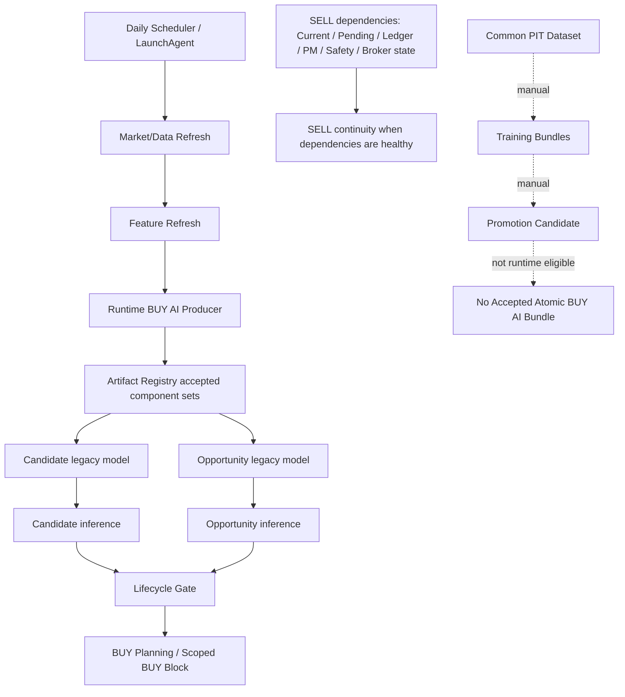
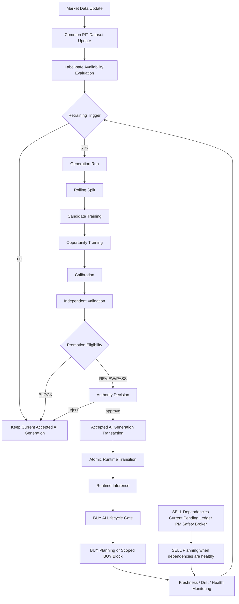
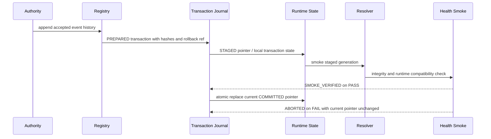

# Autonomous AI Operations Architecture

## Purpose

This document defines the target autonomous AI operations architecture for AI Fund Lab v2. The goal is not to add another parallel lifecycle, but to consolidate the existing Dataset, Training, Lifecycle, Registry, and Runtime mechanisms into one safe operating loop:

```text
market data -> label-safe dataset -> generation -> validation -> accepted authority -> runtime -> monitoring -> next generation
```

The Runtime production authority for BUY AI must be a single accepted generation. In this design, **Accepted AI Generation** is a semantic name for the existing **Accepted Atomic BUY AI Bundle** concept, not a new independent artifact family.

Strategy Layerの最上位SoTは次である。

```text
docs/02_architecture/strategy_architecture_v1.md
```

Autonomous operations must treat Strategy artifacts as accepted operational authorities when they become Production inputs. Market Context、Corporate Event Authority、Portfolio Policy、Portfolio Construction、Capital Deployment、Position ManagementのProduction共通source pathを変更する場合は、該当Artifactの正式なGeneration、Validation、Acceptance、Registry refreshを必要とする。Performance evidence may trigger review, but must not become Training, Calibration, or Runtime decision authority.

Phase21-K is the final Phase21 Design Freeze and Phase22 Entry Approval SoT. Phase22 implementation must preserve the Phase21-I Step Gates and Phase21-J Legacy Retirement rules.

Permanent training, generation, model-quality, bootstrap/retraining, and latest-data semantics are defined in:

```text
docs/02_architecture/ai_training_and_generation_lifecycle.md
```

That document is the Source of Truth for distinguishing Dataset update from AI Generation update, learning targets from non-learning Runtime components, and latest PIT inference features from latest Accepted Generation authority.

Generation output artifact schemas, immutable hash bindings, artifact authority boundaries, runtime accepted-only eligibility, serialization compatibility, reproducibility, and prohibited artifact content are defined in:

```text
docs/02_architecture/ai_generation_artifact_contract.md
```

## Current Architecture



Current facts:

| Area | Current State |
|---|---|
| Runtime Candidate | Registry accepted legacy model `sha256-2ea75d14d3fe3682` |
| Runtime Opportunity | Registry accepted legacy model `sha256-140e350bd9b12bf0` |
| Phase18 Promotion Candidate | Candidate/Opportunity training split ends `2024-12-02` |
| Accepted Atomic BUY AI Bundle | Missing |
| Common PIT Dataset | Present, max date `2026-05-15` |
| End-to-end generation chain | Not connected |

## Target Architecture



## Single Authority

Runtime inference, freshness, drift, baseline, rollback, and audit must resolve the same accepted generation:

```text
Accepted AI Generation
  = Accepted Atomic BUY AI Bundle
  = one immutable generation of:
    Dataset
    Split
    Candidate model
    Opportunity model
    Calibration
    Validation
    Runtime baseline
    Freshness metadata
    Authority decision
    Rollback reference
```

Production-equivalent Runtime must not resolve:

- legacy component model paths
- direct config model paths
- latest paths
- newest generation by Registry timestamp, filesystem mtime, `latest` symlink/directory, or `accepted_at` maximum
- manual model paths
- Promotion Candidate fallback
- test model fallback

Historical Runtime may use a historical accepted generation, but it must use the same schema and consumer contract as Production.

## Current Call Graph

| From | To | Authority | Artifact | Fallback | Failure Behavior |
|---|---|---|---|---|---|
| LaunchAgent / CLI | `run_daily_operation` | Runtime scheduler | job args / runtime state | none for production | job HALT or scoped block |
| `run_daily_operation` | `produce_buy_ai_decisions` | Runtime BUY AI producer | feature artifacts | explicit test paths only | BUY AI HALT/REVIEW |
| producer | `resolve_buy_ai_artifact_paths` | Artifact Registry accepted set | Candidate/Opportunity model members | isolated test only | fail-closed |
| producer | Candidate inference | Registry-resolved model | model hash, schema | none | candidate dependency REVIEW/HALT |
| producer | Opportunity inference | Registry-resolved model | model hash, metrics, schema | none | opportunity REVIEW/HALT |
| producer | lifecycle evidence builder | accepted/freshness/drift evidence | gate input | none | REVIEW/BLOCK |
| lifecycle gate | BUY planning | gate decision | `ai_lifecycle_gate_decision.json` | none | BUY-only block; SELL continuity is independently evaluated from SELL dependencies |

## Current Generation Flow

| Stage | Current | Classification |
|---|---|---|
| Raw Data | Runtime refresh exists | Partial |
| Normalized Data | Readers/source authority exist | Partial |
| Common PIT Dataset | Phase18 pipeline exists | Implemented, manual/operator |
| Split | Training bundle split exists | Implemented, stale policy risk |
| Candidate Training | Training bundle exists | Manual/operator |
| Opportunity Training | Training bundle exists | Manual/operator |
| Calibration | Materialized for Opportunity | Manual/operator |
| Validation | Bundle metrics exist | Implemented |
| Promotion Candidate | Phase18-I exists | Manual/operator, not Runtime eligible |
| Accepted | Legacy component accepted sets exist | Legacy only for BUY AI |
| Runtime | Registry resolver exists | Uses accepted component sets, not atomic generation |

## Duplicate Concept Consolidation

| Concept | Decision |
|---|---|
| Legacy accepted component model | Deprecate for BUY AI Runtime once Accepted AI Generation exists |
| Promotion Candidate model | Keep as pre-acceptance evidence only |
| Accepted Atomic BUY AI Bundle | Keep and rename operationally as Accepted AI Generation |
| Runtime direct model path | Keep only for isolated tests; prohibit production use |
| Registry component index | Keep for non-BUY policy sets and migration evidence; BUY Runtime must consume generation |
| Registry bundle index | Keep as accepted generation authority |
| Runtime accepted state | Keep as materialized pointer to accepted generation |
| latest path | Prohibit as authority |
| config direct path | Prohibit in production-equivalent Runtime |

## Autonomous Operations Loop

1. Market Data Update
2. Common PIT Dataset Update
3. Label-safe Availability Evaluation
4. Retraining Trigger Evaluation
5. Rolling Split Generation
6. Candidate Training
7. Opportunity Training
8. Calibration
9. Independent Validation
10. Promotion Eligibility
11. Authority Decision
12. Accepted Generation Materialization
13. Atomic Runtime Transition
14. Runtime Inference
15. Freshness / Drift / Performance-independent Monitoring
16. Rollback or Retraining Trigger
17. Next Generation

## Retraining Trigger

| Item | Design |
|---|---|
| WHEN | Daily monitoring records state; weekly or event-driven lifecycle evaluator decides whether to train |
| WHO | AI Lifecycle Scheduler Operator |
| INPUT | accepted generation, label-safe cutoff, dataset version, schema hashes, drift, model health, cooldown, minimum rows |
| OUTPUT | `GenerationTriggerDecision` recorded as lifecycle scheduler status |
| FAILURE | fail-closed for BUY if current accepted generation violates gates; otherwise keep current accepted generation and alert |

Trigger conditions are controlled by a versioned lifecycle/training policy, not by hardcoded Runtime constants. The default policy may require label-safe cutoff advancement, but every trigger decision must record:

- `retraining_policy_version`
- `minimum_label_safe_advance_business_days`
- `minimum_new_rows`
- `minimum_new_symbols`
- `cooldown_business_days`
- `training_lag_review_threshold`
- `training_lag_block_threshold`
- `drift_threshold_version`
- `freshness_policy_version`
- policy content hash

Policy change classification:

- threshold-only low-risk change
- material policy change requiring Human Review
- target / strategy / risk contract change requiring Human Review and compatibility review

Trigger examples:

- label-safe cutoff advanced by at least the versioned policy default
- model training lag exceeds review threshold
- dataset version changed and minimum new rows are available
- feature schema changed
- drift REVIEW/BLOCK or all-negative sequence
- current accepted generation unhealthy
- cooldown elapsed
- previous generation is not already running or pending review

## Rolling Split Policy

Every generation creates an immutable split from the current label-safe dataset authority.

| Split | Target Role |
|---|---|
| Train | model fitting only |
| Calibration | calibration fit only |
| Validation | model selection and threshold review |
| Test | independent predictive validity check |
| Recent Holdout | final operational readiness and baseline source |

Rules:

- non-overlapping business-date windows
- no fixed historical split reuse after dataset refresh
- label horizon buffer enforced before split creation
- PIT and NO_LEAKAGE validation required before training
- minimum rows and minimum business dates required per split
- market regime coverage recorded
- holdout is not reused for iterative tuning after final model selection

## Candidate / Opportunity Generation

Candidate, Opportunity, Calibration, and Runtime baseline are members of one Accepted AI Generation assembly and transaction. This does not mean every component must be retrained in every generation run.

Terminology:

- `generation run` means the execution that builds or evaluates one or more components.
- `Accepted AI Generation assembly` means the atomic accepted membership manifest and transaction consumed by Runtime.

New component retraining is required when policy, schema, lineage, freshness, model health, calibration, validation applicability, or compatibility evidence requires it. Reusing a previous component is allowed only when all of the following pass:

- feature schema compatibility
- input/output schema compatibility
- target contract compatibility
- dataset lineage compatibility
- freshness policy
- model health
- calibration applicability
- validation applicability
- policy version compatibility

Every reused member must record:

- `source_generation_id`
- `component_revision`
- `reused=true`
- model hash
- schema hash
- validation applicability evidence

Candidate outputs:

- dataset authority
- feature schema
- split reference
- model hash
- prediction output schema
- validation metrics

Opportunity inputs:

- same Accepted AI Generation ID
- same dataset generation family
- Candidate generation reference
- Candidate output schema/hash
- BV15 contract

Opportunity must use the Candidate member specified in the same Accepted AI Generation manifest. It may not perform implicit cross-generation Candidate path search.

## Calibration

Calibration is part of the generation, not a loose helper file.

Required calibration evidence:

- target Opportunity model hash
- fit dataset and split
- fit period and rows
- input prediction hash
- output schema
- validation/test/holdout separation
- calibration hash
- stale rule: Opportunity model hash change invalidates prior calibration

## Validation and Promotion

Promotion eligibility is not a single metric. It evaluates:

- PIT
- NO_LEAKAGE
- schema compatibility
- lineage
- deterministic rebuild
- Candidate metrics
- Opportunity Spearman / Top-k / monotonicity
- positive coverage
- NO BUY ratio
- stability
- BV15
- calibration integrity
- baseline readiness
- freshness
- rollback readiness

Status:

```text
PASS
REVIEW_REQUIRED
BLOCK
```

## Authority Model

Use four decisions, mapped onto existing evidence rather than new parallel artifacts:

1. Generation Validation Decision
2. Promotion Decision
3. Accepted Decision
4. Rollback Decision

Recommended approval mode:

```text
normal low-risk refresh: automatic Accepted Decision after all gates PASS
material model/schema/strategy change: human review required
BLOCK / hash mismatch / lineage mismatch: rejected until remediated
emergency rollback: operator-confirmed or pre-authorized automatic rollback to previous accepted generation
```

## Accepted AI Generation Schema

Minimum fields:

- `generation_id`
- `dataset_bundle_ref`
- `split_ref`
- `candidate_model_ref`
- `opportunity_model_ref`
- `calibration_ref`
- `validation_ref`
- `runtime_baseline_ref`
- `freshness_metadata_ref`
- `accepted_at`
- `previous_generation_ref`
- `members` with `source_generation_id`, `component_revision`, reuse flag, component hashes, schema hashes, and validation applicability evidence
- `component_hashes`
- `aggregate_hash`
- `source_commit`
- `authority_decision_ref`

Runtime may only resolve the current `COMMITTED` pointer to this unit. Promotion Candidate, manual path, legacy component, and `latest` resolution are not Runtime authority.

## Runtime Transition



Transition states:

- `PREPARED`
- `STAGED`
- `SMOKE_VERIFIED`
- `COMMITTED`
- `ABORTED`
- `ROLLED_BACK`

Production resolver reads only the current `COMMITTED` Runtime accepted generation pointer. `PREPARED` and `STAGED` states are not public Runtime authority. A process kill resolves from the transaction journal: before commit, the current committed pointer remains authoritative; after commit, the committed pointer is authoritative and rollback requires a new rollback decision.

Registry accepted history, transaction journal, and Runtime pointer are separate authorities with separate write semantics:

- Registry accepted history is append-only.
- Transaction journal records transition state.
- Runtime pointer exposes exactly one current `COMMITTED` generation.

Failure behavior:

- partial writes never become accepted Runtime state
- smoke failure leaves the current committed pointer unchanged
- failed transition is recorded as `ABORTED`
- crash injection must pass before and after commit
- rollback appends rollback decision/evidence and atomically moves the committed pointer to a previous healthy generation
- accepted event history is not rewound
- derived indexes may be rebuilt from immutable history only
- verify previous resolver
- BUY remains blocked if recovery cannot prove previous generation
- SELL continuity is independently evaluated and continues only if Current/PM/Safety/Broker dependencies are healthy

## Monitoring

| Layer | Metrics |
|---|---|
| Data | raw freshness, normalized freshness, PIT dataset freshness, label-safe availability, schema, missingness |
| Model | training lag, accepted age, prediction drift, feature drift, positive coverage, all-negative sequence, candidate population |
| Runtime | resolver generation ID, loaded model hashes, accepted generation hash, decision artifact generation ID |
| Pipeline | last dataset update, last retraining, last validation, last promotion, last accepted transition, failed stage, recovery command |

## Recovery

| Failure | Runtime | BUY | SELL | Retry | Operator |
|---|---|---|---|---|---|
| Dataset generation failure | current accepted generation | continue if gates pass | continue | yes | alert if repeated |
| Training failure | current accepted generation | continue if gates pass | continue | yes | required after repeated failure |
| Calibration failure | current accepted generation | continue if gates pass | continue | yes | review |
| Validation BLOCK | current accepted generation | continue if gates pass | continue | no auto accept | review |
| Promotion failure | current accepted generation | continue if gates pass | continue | yes | review |
| Accepted transaction failure | current committed generation | block if committed authority unverified | continue if safe | abort transaction | required |
| Runtime transition failure | current committed generation or rollback decision target | block until verified | continue if safe | append rollback decision if needed | required |
| Resolver reload failure | current committed generation | block | continue if safe | abort or append rollback decision | required |
| Post-transition smoke failure | current committed generation unchanged before commit; rollback decision target after commit | block until verified | continue if safe | abort or append rollback decision | required |
| Scheduler crash | last committed state | unchanged | unchanged | resume by idempotency | alert |
| Partial artifact write | no publish | block affected generation | continue | retry | alert |
| Hash mismatch | no publish | block | continue | no | required |

## Automation Level

| Stage | Current | Target | Trigger | Authority | Automatic | Human Review | Failure Behavior |
|---|---|---|---|---|---|---|---|
| Market data | partial automatic | automatic | daily | market data producer | yes | no | data gate review/block |
| Dataset | manual/operator | automatic with lock | label-safe/source ready | Dataset Bundle | yes | no unless schema break | keep current generation |
| Retraining decision | partial scheduler | automatic evaluator | weekly/event | Trigger Decision | yes | no | alert/no action |
| Split generation | training-time, stale risk | automatic per generation | retrain yes | Split Definition | yes | no | block generation |
| Candidate training | manual | automatic after split | generation run | Training Bundle | yes | no | keep current generation |
| Opportunity training | manual | automatic after Candidate | generation run | Training Bundle | yes | no | keep current generation |
| Calibration | manual | automatic with Opportunity | model hash change | Calibration Artifact | yes | no | block generation |
| Validation | implemented | automatic | training complete | Validation Decision | yes | review on REVIEW_REQUIRED | reject generation |
| Promotion | manual | automatic candidate packaging | validation PASS/REVIEW | Promotion Decision | yes | review on material change | no accept |
| Accepted | manual | automatic for low-risk PASS | promotion approved | Accepted Decision | conditional | yes for material change | no runtime switch |
| Runtime transition | missing atomic generation | atomic automatic | accepted commit | Accepted AI Generation | conditional | no if low-risk | rollback |
| Monitoring | partial | automatic | daily/event | Runtime evidence | yes | alert review | BUY block / continue SELL |
| Rollback | partial | atomic pointer transition | transition failure / emergency | Rollback Decision | conditional | emergency review | append rollback evidence and move committed pointer only |
| Recovery | partial | idempotent | failure | Recovery evidence | yes | when manual recovery required | fail-closed BUY |

## Scheduler Design

Daily:

- market refresh
- feature refresh
- inference
- Runtime operation
- monitoring

Weekly / condition-triggered:

- label-safe dataset update
- retraining evaluation
- generation run
- validation
- promotion packaging

Event-driven:

- drift escalation
- freshness BLOCK
- accepted transition failure
- rollback
- recovery

Scheduler requirements:

- LaunchAgent starts only thin CLIs
- lifecycle lock per generation/component family
- idempotency key = generation cutoff + dataset hash + config hash
- resume from last committed stage
- no duplicate training publish
- no partial accepted state

## Operational Scenarios

| Scenario | Behavior |
|---|---|
| Normal | current COMMITTED Runtime accepted generation pointer resolves; BUY proceeds through BUY gates and SELL proceeds through its independent dependencies |
| New Data, No Retraining Needed | dataset updates; current accepted generation remains if freshness/drift pass |
| Scheduled Retraining | new generation is built, validated, and conditionally accepted |
| Validation Failure | current accepted generation remains |
| Freshness BLOCK | BUY blocks; SELL continuity is independently evaluated from SELL dependencies; retraining trigger escalates |
| Drift REVIEW | current generation may continue with BUY review/block depending scope; new generation evaluated |
| Runtime Transition Failure | current committed pointer remains unchanged before commit; after commit, rollback appends evidence and atomically moves the committed pointer to a previous healthy generation |
| System Restart | resolver loads current COMMITTED accepted generation pointer; scheduler resumes by idempotency |

## Existing Implementation Gap Analysis

| Component | Decision | Reason |
|---|---|---|
| Dataset pipeline | KEEP/MODIFY | PIT bundle is useful; needs scheduler integration |
| Training pipeline | KEEP/MODIFY | bundle structure useful; split policy must refresh by label-safe cutoff |
| Calibration pipeline | KEEP/MERGE | keep as generation member tied to Opportunity hash |
| Lifecycle Scheduler | MODIFY | currently review-oriented; must orchestrate generation stages |
| Promotion Candidate | MERGE | keep as pre-accepted generation evidence |
| Registry | KEEP/MODIFY | keep hash authority; add accepted generation as Runtime unit |
| Authority workflow | MERGE | consolidate promotion/accepted decisions |
| Runtime baseline | KEEP/MERGE | generation member, not separate authority |
| Freshness metadata | KEEP/MERGE | generation member, not separate authority |
| Runtime resolver | MODIFY | accepted generation only |
| Legacy resolver | DEPRECATE | isolated tests only |
| Rollback | KEEP/MODIFY | append rollback evidence and move Runtime committed pointer atomically without rewinding Registry history |
| Runtime Test Runner | MODIFY | use accepted generation and scoped BUY block semantics |

## Superseded Phase18-AC Historical Implementation Units

DO NOT USE FOR IMPLEMENTATION OR ACCEPTANCE. Authoritative implementation units are AD-U1 through AD-U7.

1. Generation identity, Dataset authority, Rolling Split
2. Candidate / Opportunity / Calibration unified generation run
3. Validation, Promotion, Accepted Transaction
4. Runtime Accepted-only Resolver and Atomic Transition
5. Scheduler, Trigger, Monitoring, Recovery
6. Production-equivalent End-to-End Acceptance

Each unit must consume the previous unit's artifact as its real input.

## Acceptance Conditions

AI Fund Lab v2 can claim safe autonomous AI operation only when:

- one accepted generation authority drives inference, freshness, drift, baseline, and rollback
- new dataset does not silently imply new AI, but does trigger deterministic retraining evaluation
- fresh generation can be produced without manual file edits
- low-risk PASS generations can be accepted and transitioned atomically
- material changes require human review
- BUY fails closed on missing/mismatched evidence
- SELL continuity is preserved on BUY-only AI failures
- rollback is verified before Runtime resumes BUY
- historical and production Runtime use the same accepted generation contract

## Phase18-AD Amendment: Closure Review Contracts

Phase18-AD reviewed this architecture against the Phase18-AB systemic generation gap and the repository Runtime call graph. The target loop remains valid, but implementation must not start from Phase18-AC as disconnected feature work. It must start from the end state:

```text
new market data
-> formal dataset update
-> retraining eligibility
-> complete generation
-> independent validation
-> authority decision
-> atomic runtime transition
-> daily operation continues
-> rollback or recovery without routine human file edits
```

The following contracts amend this document and are part of the implementation SoT.

### AD-1 Current Production-Reachable Authority Inventory

| Area | Current Implementation | Runtime Reachability | Target State |
|---|---|---|---|
| BUY model resolver | `resolve_buy_ai_artifact_paths()` resolves `CANDIDATE_AI_SET` and `OPPORTUNITY_AI_SET` Registry accepted component sets | Production reachable via `produce_buy_ai_decisions()` | Replace for BUY AI with accepted generation resolver |
| Lifecycle evidence resolver | `.runtime/runtime_state/accepted_buy_ai_bundle.json` only; manual path rejected for production root | Production reachable inside BUY AI lifecycle gate | Keep and make it the single BUY AI authority |
| Promotion Candidate | `.runtime/artifact_registry/promotion_candidates/transactions/...` | Not runtime eligible; forbidden as Runtime fallback | Keep as pre-acceptance evidence only |
| Legacy direct model defaults | `DEFAULT_CANDIDATE_MODEL_PATH`, `DEFAULT_OPPORTUNITY_MODEL_PATH` | Isolated non-`.runtime` test roots only | Keep only for isolated tests; add static negative tests |
| Runtime Test Runner | normal Runtime CLI plus scoped BUY-only classification | Historical production-equivalent reachable | Keep; continue SELL only on scoped BUY-only |
| Scheduler | weekly lifecycle operator writes status/report/alert | Not connected to full generation-to-accepted loop | Extend after bootstrap and authority contracts exist |

Current reachable mismatch:

```text
Runtime inference authority = Registry accepted component sets
Lifecycle Gate authority = Accepted Atomic BUY AI Bundle state
```

This two-authority structure is a formal design gap. It is allowed only as a migration state and must be removed before autonomous operation is called ready.

### AD-2 Bootstrap Contract

When no accepted generation exists:

| Item | Contract |
|---|---|
| Initial generation producer | AI Lifecycle Control Plane creates a generation from Common PIT Dataset using formal split and validation contracts |
| Human approval | Required for the first accepted generation because there is no previous accepted baseline |
| Previous generation ref | `previous_generation_ref=null` is allowed only in explicit bootstrap artifacts |
| Failure during bootstrap | No Registry accepted event, no Runtime accepted state, no partial accepted generation |
| BUY behavior | BUY planning and BUY submit remain blocked until bootstrap accepted generation passes Runtime transition smoke |
| SELL / Current / Valuation / PM / Safety | Continue when their own authorities are healthy; bootstrap failure must not globally stop SELL |
| Normal transition | After first accepted generation and runtime smoke, future low-risk generations may use automatic approval rules |

Manual JSON creation is not a valid bootstrap path.

### AD-3 Data Sufficiency Contract

Dataset presence is not sufficient to train. Candidate and Opportunity generation must record minimum business days, row count, eligible symbols, positive labels, missingness upper bound, universe coverage, sector and market coverage, corporate action integrity, calendar coverage, label completion, label-safe horizon, source consistency, and duplicate/gap limits.

Insufficient new data is not a Dataset failure. It must produce a lifecycle state such as:

```text
NO_RETRAIN_INSUFFICIENT_NEW_DATA
```

The current accepted generation continues unless its own freshness or integrity gate blocks BUY. If current accepted freshness is BLOCK, BUY stays blocked and SELL continuity is evaluated independently.

### AD-4 Data Revision Contract

J-Quants corrections, corporate actions, delistings, code changes, and calendar corrections are authority-changing events. Dataset hash changes caused by historical revisions require impact assessment.

| Revision | Required Action |
|---|---|
| non-label-affecting small correction | evidence and possible no-retrain decision |
| label-affecting correction inside train/calibration/validation/test/holdout | rebuild and retraining required |
| calendar correction changing label-safe cutoff or split windows | split rebuild required |
| corporate action integrity failure | generation BLOCK |
| accepted generation lineage affected | retrain or authority review; rollback alone is insufficient |

### AD-5 Split Lifecycle Contract

Each generation must produce an immutable split policy artifact with train, calibration, validation, test, and recent holdout periods; label horizon buffer; minimum business days; regime coverage; overlap rejection; split maintain condition when dataset advancement is too small; holdout reuse count; and split policy version.

After holdout evaluation, retuning against the same holdout is prohibited. Split policy version changes require Human Review.

### AD-6 Training Reproducibility Contract

Every generation must include source commit, Python version, dependency lock hash, library versions, CPU/architecture, random seed, training config hash, feature schema hash, code entrypoint, command arguments, and environment identity. Non-reproducible generations are not promotion eligible.

### AD-7 Unified Compatibility Contract

Compatibility must be checked across all runtime consumers:

| Boundary | Required Contract Test |
|---|---|
| Candidate output -> Opportunity input | schema, key, candidate_source_ref |
| Opportunity output -> Calibration | score and target schema |
| Calibration output -> Planning | calibrated score semantics |
| Planning -> Capital Allocation | decision and sizing input schema |
| Planning -> Public Report | report field compatibility |
| Planning -> Audit | lineage and reason-code compatibility |
| Runtime Gate -> BUY/SELL control | scoped block semantics |

### AD-8 Model Quality Contract

Generation quality thresholds must be declared before the run. Required metrics include Candidate quality, Opportunity Spearman, Top-k, monotonicity, positive coverage, NO BUY ratio, stability, BV15, calibration integrity, regime stability, population sufficiency, deterministic rebuild, PIT, and NO_LEAKAGE.

Each metric must classify `PASS`, `REVIEW_REQUIRED`, `BLOCK`, and `METRIC_UNAVAILABLE`. Runtime PnL, Paper Ledger, Broker Snapshot, selected/bought, cash, portfolio value, and backtest result are forbidden as training inputs or automatic promotion metrics.

### AD-9 Automatic Approval Boundary

Automatic accepted transition is allowed only when feature schema, label schema, model family, target, strategy, and Risk/Safety contracts are unchanged; all required metrics PASS; no lineage warning exists; no data revision requires review; no compatibility change exists; and rollback target is healthy.

Any exception routes to Human Review. If Human Review expires, keep the current accepted generation. If the current accepted generation is freshness BLOCK, block BUY only and keep SELL continuity where dependencies permit.

### AD-10 Runtime Transition Compatibility

Generation transition must not reset or reinterpret open positions, Pending, Current, Ledger, SELL/HOLD inference, Capital Allocation, active orders, valuation, Safety state, or current business date. Transition acceptance must prove trading-state hashes are unchanged except for explicit Runtime accepted generation pointers and transition evidence.

### AD-11 Schema Migration Contract

Schema changes require compatibility classification, dual-read plan when needed, migration artifact, rollback compatibility check, old generation reload test, incompatible rollback prohibition, and Human Review when Runtime consumer behavior changes.

### AD-12 Legacy Removal Proof

Legacy BUY AI resolution is removed only when Production and Historical production-equivalent call graphs cannot reach Registry component direct model resolution for BUY AI; config direct model path is absent; hardcoded production path is absent; latest fallback is absent; manual path fallback is absent; Promotion Candidate fallback is absent; and static search, dynamic call graph, and negative tests pass.

Removal order:

1. Implement accepted generation resolver as read-only parallel evidence.
2. Switch BUY AI producer to accepted generation in non-production smoke.
3. Prove Historical production-equivalent path uses accepted generation.
4. Switch production-equivalent Runtime to accepted generation.
5. Remove component-set BUY model resolution from production path.
6. Keep component registry for non-BUY policy sets and audit history only.

### AD-13 Concurrency, Idempotency, and Resume

Dataset update, split build, training, calibration, validation, promotion request, accepted transaction, runtime transition, and rollback must be idempotent under duplicate execution. Required controls are generation idempotency key, stage locks, stale lock evidence, transaction journal, resume artifact, retry policy, duplicate generation rejection, and process-kill recovery.

### AD-14 Storage, Retention, and Integrity

Autonomous operation must define immutable artifact retention, accepted generation retention, rollback generation retention, failed generation retention, temporary cleanup, disk capacity threshold, corruption scan cadence, Registry backup, Runtime accepted state backup, disaster recovery, and retention deletion reference checks.

### AD-15 External Dependency Failure

J-Quants outage, partial API response, malformed data, rate limit, calendar unavailable, disk full, clock/timezone issue, source commit unavailable, dependency install failure, and notification failure must stop only the affected lifecycle stage unless they compromise current Runtime authority. AI generation failure must not stop SELL solely because retraining failed.

### AD-16 Monitoring and Alerting

Operator alerts are required for Dataset stale, retraining due, retraining failed, Validation BLOCK, Human Review pending, accepted transition failed, rollback occurred, current accepted stale, BUY blocked, legacy resolver reached, hash mismatch, lineage mismatch, disk capacity warning, scheduler missed, and recovery required. Notification failure must itself be written as evidence.

### AD-17 Security and Secrets Boundary

Training and lifecycle jobs must not require Broker credentials or submit permissions. Artifact modification must be hash-detected. Approval identity, audit logs, file permissions, secret canary checks, and public-report redaction are required before production-equivalent acceptance.

### AD-18 Failure Matrix Requirement

Each implementation unit must update the failure matrix for raw data missing, partial normalized data, PIT Dataset missing rows, label-safe not advanced, insufficient training data, split overlap, training crash, missing model artifact, calibration mismatch, Validation BLOCK, promotion transaction failure, Authority timeout, accepted transaction partial failure, Registry index mismatch, Runtime accepted state missing, resolver hash mismatch, schema incompatibility, transition smoke failure, rollback failure, scheduler missed, duplicate execution, process restart, artifact corruption, disk full, current accepted freshness BLOCK, drift REVIEW/BLOCK, no healthy previous generation, notification failure, and legacy resolver unexpectedly reached.

### AD-19 Production-equivalent Acceptance Contract

No implementation may be marked complete until static acceptance, real J-Quants-derived generation, Runtime transition smoke, multi-day Historical acceptance, failure injection, and autonomous operation acceptance all pass. Mock-only evidence is insufficient.

### AD-20 Architecture Coverage Matrix Requirement

Before any phase can claim COMPLETE or READY, every area in the architecture coverage matrix must be classified as `VERIFIED`, `VERIFIED_WITH_LIMITATION`, or `NOT_APPLICABLE`. Any `UNKNOWN` or `BLOCKED` prevents readiness.

### AD-21 Revised Implementation Units

| Unit | Goal | Acceptance |
|---|---|---|
| AD-U1 Bootstrap and Authority Unification | create initial accepted generation path without manual JSON and prove runtime/lifecycle use the same authority | no accepted generation -> BUY blocked/SELL continuity; accepted bootstrap smoke PASS |
| AD-U2 Dataset-to-Split Sufficiency Slice | Common PIT update, data sufficiency, revision, label-safe, rolling split | insufficient data emits no-retrain state; sufficient data emits immutable split |
| AD-U3 Unified Generation Slice | Candidate, Opportunity, Calibration, baseline, reproducibility in one generation id | component hashes and lineage share one generation |
| AD-U4 Validation-to-Authority Slice | quality, compatibility, promotion, approval boundary | PASS/REVIEW/BLOCK routes deterministic |
| AD-U5 Atomic Runtime Transition Slice | accepted transaction, runtime state materialization, transition smoke, rollback | no partial accepted state under injected failures |
| AD-U6 Autonomous Scheduler and Recovery Slice | scheduler, locks, resume, alerts, retention, external failure handling | duplicate/restart/outage scenarios PASS |
| AD-U7 Production-equivalent E2E Slice | real-data multi-day historical and failure injection | production-equivalent acceptance PASS |

### AD-22 Completion Language Guard

The system must not be described as complete, ready, production-ready, final, or autonomous until Dataset to Runtime is traceable by one generation id; Runtime inference and Lifecycle Gate use the same accepted authority; legacy BUY AI resolver is unreachable in production-equivalent call graphs; Candidate, Opportunity, Calibration, and baseline are same generation; rolling split updates on real data; Scheduler reaches retraining; low-risk transition works without manual file edits; material changes route to Human Review; BUY-only fail-closed and SELL continuity are proven; and atomic transition, rollback, restart, resume, failure injection, and production-equivalent E2E evidence exist.

## Phase18-AE Amendment: Final System Review Clarifications

Phase18-AE reviewed this SoT candidate against project goals, Runtime Architecture v2, Runtime Test Specification, Registry contracts, implementation call graph, and Phase18-AB through Phase18-AD evidence. The architecture remains directionally valid and does not require a new authority, artifact family, lifecycle, or redesign. The following clarifications are required before Phase19 implementation.

### AE-1 Implementation Unit Supersession

The original Phase18-AC implementation units 1 through 6 are historical design scaffolding. They are superseded by AD-U1 through AD-U7 for implementation planning and acceptance.

```text
authoritative implementation units = AD-U1 ... AD-U7
superseded units = Phase18-AC units 1 ... 6
```

Any implementation plan, tracker, or acceptance report must use AD-U1 through AD-U7. The superseded Phase18-AC unit list may remain in the document only as design history.

### AE-2 Actor Terminology

`AI Lifecycle Scheduler Operator` means a software actor: a CLI, scheduler job, or LaunchAgent-started lifecycle process that evaluates lifecycle eligibility and orchestrates generation stages. Human actors are named `Human Reviewer`, `Authority Reviewer`, or `Operator` only when explicit approval, emergency action, or manual recovery is required.

### AE-3 Performance-independent Monitoring

`Performance-independent Monitoring` means monitoring that may trigger lifecycle review without using prohibited trading outcome data as training or automatic promotion input.

Allowed for lifecycle health:

- model predictive quality metrics computed from label-safe datasets
- calibration quality
- drift
- freshness
- population and positive coverage
- runtime operational health
- data sufficiency

Forbidden as training input or automatic promotion signal:

- Runtime PnL
- Paper Ledger
- Broker Snapshot
- selected / bought flags
- cash
- portfolio value
- backtest profit result

Portfolio/trading performance may be reported for strategy and portfolio review, but it must not bypass PIT, NO_LEAKAGE, Safety, Authority, or model-quality contracts.

### AE-4 Historical Accepted Generation Contract

Historical Runtime must not apply a future Production accepted generation to past business dates. Historical production-equivalent runs must resolve an accepted generation whose `effective_from`, `accepted_at`, dataset lineage, feature schema, model training cutoff, calibration cutoff, baseline cutoff, and trading calendar authority are valid for the historical evaluation time.

When historical generation authority is unavailable, Historical Runtime must fail closed for the affected BUY path and report insufficient evidence rather than falling back to latest, manual, Promotion Candidate, or legacy component model paths.

### AE-5 Runtime Baseline Source

Runtime drift baseline is a materialized generation member. Its source must be one of:

- Recent Holdout prediction/feature distributions from the accepted generation, or
- a separately materialized baseline artifact whose lineage points to accepted generation evaluation data and does not include post-acceptance Runtime trading outcomes.

Accepted Runtime observation may be used for operational monitoring after deployment, but it is not a substitute for the accepted generation baseline and must not be used as training data or automatic promotion evidence.

### AE-5.1 Phase19-AO Recent Holdout De-scope and Baseline Source

For Phase19 bootstrap/corrective generation only, Human Architecture Decision `Phase19-AO` de-scopes Recent Holdout from Accepted Generation entry:

```text
recent_holdout_required_for_phase19_acceptance = false
recent_holdout_required_for_phase19_accepted_decision = false
recent_holdout_required_for_phase19_runtime_transition = false
recent_holdout_required_for_phase19_runtime_readiness = false
recent_holdout_used_for_phase19_runtime_baseline = false
recent_holdout_accessed = false
```

Recent Holdout remains a reserved split. It must not be deleted, reused, transformed into training input, used for fit, tuning, threshold selection, calibration fit, method selection, Corrective Re-evaluation, or Formal Validation overwrite in Phase19.

The Phase19 Runtime Baseline source is:

```text
Formal Validation / Corrective Re-evaluation test-window inference outputs
+
CandidateTop50 selection outputs
```

The baseline is operational health and drift comparison evidence only. It must not overwrite Formal Validation, rerun Dual Gate, or directly drive daily Runtime BUY decisions.

Future phases may reactivate Recent Holdout only through an explicit versioned contract amendment and Human Review.

### AE-6 Rollback and Data Revision

Rollback restores a previously accepted generation only when that generation's dataset lineage and authority remain valid. If a data revision invalidates the previous generation lineage, rollback to that generation is prohibited and the correct recovery action is rebuild/retrain/re-authority review, with BUY blocked and SELL continuity evaluated independently.

### AE-7 Freshness Taxonomy

Freshness evidence must distinguish:

| Freshness Type | Meaning | Owner |
|---|---|---|
| Raw data freshness | latest J-Quants source availability | Data Layer |
| Normalized data freshness | normalized source coverage and hash | Data Layer |
| Dataset freshness | Common PIT Dataset max target date and content hash | Dataset Pipeline |
| Label-safe freshness | latest date whose labels are complete for target horizon | AI Lifecycle |
| Model training freshness | model training cutoff relative to label-safe cutoff | Training Pipeline |
| Accepted generation age | accepted_at relative to decision date | Authority / Registry |
| Runtime loaded generation freshness | loaded accepted generation identity and load time | Runtime Resolver |
| Inference feature freshness | feature_date and as-of evidence for current inference | Runtime Feature Pipeline |

No implementation may collapse these into a single ambiguous `freshness` field for gating, reporting, or acceptance.

### AE-7.1 Phase19-AO Freshness Metadata Placement

Phase19 Accepted Generation entry must keep the eight freshness dimensions separate and place them by owner:

Generation-bound freshness in the Accepted Generation Manifest:

```text
raw_data_max_date_at_generation
normalized_data_max_date_at_generation
dataset_revision_id
dataset_source_max_date
dataset_target_max_date
label_safe_cutoff
candidate_training_cutoff
opportunity_training_cutoff
calibration_cutoff
validation_cutoff
generation_created_at
freshness_policy_version
```

Materialization-time freshness:

```text
accepted_at
effective_from
accepted_generation_age_origin
```

Runtime-time freshness in Runtime State / Monitoring:

```text
runtime_loaded_generation_id
runtime_loaded_at
runtime_loaded_generation_age
inference_feature_date
expected_inference_feature_date
raw_refresh_status
normalized_refresh_status
dataset_refresh_status
```

Schema mismatch, hash mismatch, or a missing required generation-bound freshness field is a BLOCK condition. Raw or normalized data staleness alone must not automatically stop SELL.

### AE-8 Trading State and Broker Boundary

Accepted BUY AI generation does not own Current, Pending, Ledger, Safety, Broker Snapshot, Submit Guard, Execution, or Broker write authority. Runtime transition may update only accepted generation pointers and transition evidence. It must not reset positions, cash, pending orders, approvals, safety locks, broker evidence, or ledger records.

### AE-8.1 Generation-Bound Scaler Boundary

Feature scalers are preprocessing artifacts inside an AI Generation. They are not standalone Runtime authority and must not be discovered by latest path, mtime, component model directory, or Registry fallback.

Future Runtime inference must resolve:

```text
Accepted Generation
-> generation-bound imputer
-> generation-bound scaler
-> generation-bound model
```

Runtime must reject scaler hash mismatch, model/scaler component mismatch, feature order mismatch, unreviewed scaler artifacts, and direct Training Artifact scaler use. Adding a scaler contract does not authorize Accepted Generation creation, Runtime transition, BUY restart, or Broker write.

### AE-8.2 AI Status Inspection Boundary

`scripts/runtime_test.py ai-status` is a read-only operational observability command. It may inspect the COMMITTED Accepted Generation pointer, Accepted Generation Manifest, Candidate / Opportunity bindings, freshness metadata, runtime lifecycle gate evidence, latest J-Quants date, latest BUY feature date, runtime readiness, and legacy fallback absence.

It must not mutate authority or trading state:

```text
No Accepted Generation creation
No authority history append
No runtime pointer write
No training
No calibration
No validation rerun
No Unified Generation
No Runtime transition
No BUY restart
No Broker access
No Broker write
```

`ai-status` does not become Runtime authority. It reports the authority state produced by the Accepted Generation Resolver. Statistical drift findings are REVIEW_REQUIRED observability findings unless paired with a structural failure; they do not by themselves authorize automatic BUY stop, SELL stop, Runtime transition, or Production Ready.

### AE-8.3 System Status Operational Boundary

`scripts/runtime_test.py system-status` is the recommended daily pre-operation read-only health command for the entire AI Fund Lab v2 system. It supersedes `ai-status` as the normal operator entrypoint, while `ai-status` remains the narrower AI Artifact Inspection command.

`system-status` may inspect:

```text
Data: J-Quants, Raw, Normalized, Feature, Dataset, Split
AI: Candidate, Opportunity, Calibration, Runtime Baseline, Freshness, Accepted Generation
Runtime: Resolver, COMMITTED authority, Runtime Consumer, Lifecycle, Threshold, BUY Planning, SELL Continuity
Runtime State: Current, Pending, Ledger, PM, Safety
Broker Layer: Approval, Submit Guard, Execution, Broker Connection, Notification, Reporting
Overall: PASS / REVIEW_REQUIRED / BLOCK
```

It must not train, calibrate, validate, create generations, mutate authority history, write Runtime pointers, mutate Trading State, restart BUY, access Broker credentials/API, write Broker orders, or send notifications.

The default human output is a compact operator overview, not the full inspection report. It must show Inspection Context, separated status judgments, key data freshness dates, Runtime execution/current-state status, Accepted Generation age with explicit units, important findings, and the final scoped judgment. Full inspection remains available by explicit scope (`--scope full` or the `--full` alias). Scope-specific output may be requested with `--scope overview|data|ai|runtime|broker|readiness|lineage|components|full`; exactly one scope is selected per invocation.

Full inspection output lists active and inactive AI/system components, all active Data/Dataset/Feature inputs, trained models and attached scaler/calibration artifacts, rule/threshold-based decision subsystems, Accepted Generation authority binding, Runtime State artifacts, Broker Layer local status, and the full Freshness Matrix. Counts must be semantic: Candidate evaluated symbol count is separate from Candidate output count, and Opportunity input candidate count is separate from ranking and Top20 counts.

Runtime State Safety inspection is timing-aware. If the expected target-date Safety Decision is missing before the target-date Runtime route starts, `system-status` reports `PRE_RUN_NOT_MATERIALIZED` / `NOT_YET_APPLICABLE`; this does not block Day1 start by itself. If target-date Safety or Morning route evidence exists and the latest Safety Decision is still missing, `system-status` reports `POST_RUN_MATERIALIZATION_MISSING` / `BLOCK`. If an artifact exists but the business date differs from the expected target date, the result is `REVIEW_REQUIRED`.

Phase19-BC extends this timing-aware rule to target-date Runtime Features, Candidate/Opportunity Inference, AI Lifecycle Gate, Runtime Baseline/Freshness decisions, BUY/SELL Planning, Approval, Submit, Execution, Reporting, and Notification. Missing artifacts are normal before their expected generation stage and must be reported as `NOT_YET_APPLICABLE`; after the relevant stage has completed, the same missing artifact is `BLOCK`. Candidate/Opportunity model authority, artifact hashes, scaler/calibration resolution, and read-only loader validation are separate from target-date inference output existence.

Phase19-BD requires `system-status` to report operational truth by environment. A Historical isolated pre-run PASS is not Production readiness. Demo current-data readiness, Production current-data readiness, Broker connectivity readiness, Broker write readiness, multi-day continuity readiness, and autonomous operation readiness must be separated and shown as `NOT_EVALUATED`, `NOT_PERFORMED`, or `PROHIBITED` unless actually verified. Broker `NOT_PERFORMED` must not be displayed as connectivity PASS.

Phase19-BE requires `system-status` to close complete AI input lineage in both human and JSON outputs. Candidate and Opportunity must expose their training dataset revision, dataset artifact / manifest path, source authority, source earliest/latest date, source row/symbol/schema/content hash, split window statistics for Training, Calibration, Validation, Test, and Recent Holdout, recent holdout non-use, and calibration / validation independence. Runtime input lineage is a planned pre-run contract until the target-date Runtime route materializes features and inference, and empty placeholders are prohibited.

Phase19-BF requires `system-status` to close complete operational component inspection. All Runtime operation components must be inventoried with authority, implementation, input/output artifacts, input dependencies, business-date lineage, configuration status, runtime status, inspection status, Runtime-chain position, J-Quants dependency, and Runtime State coverage. A repository operation component that is not represented in inspection coverage is a contract failure and must not be hidden behind an overall PASS.

Phase19-BG requires `system-status` to prevent operational status ambiguity. Inspection success, implementation/configuration validity, authority resolution, target-date execution, and runtime result are distinct statuses. PRE_RUN not-yet-executed components must be classified as `NOT_YET_APPLICABLE`, `NOT_PERFORMED`, or `NOT_YET_MATERIALIZED`, not Runtime result PASS. J-Quants dependency must be classified as `DIRECT`, `INDIRECT`, or `NONE` with a path and reason. Historical source availability beyond target date must be separated from consumer cutoff and future-row consumption.

Phase19-BW requires `system-status` to separate Runtime execution truth from AI Model Health review. A statistical Model Health `REVIEW_REQUIRED` finding must expose trigger/metric/threshold/policy/observed values and BUY/SELL/Runtime impact, but it must not turn completed Runtime execution into `REVIEW_REQUIRED` when Runtime consumers and BUY/SELL action impacts are PASS/NONE. Historical post-run inspection uses closed-run evidence, final completed business date, and target-date exact-match artifacts as authority; missing non-retained transient artifacts after a successful run are not data sufficiency blockers. Future-dated fixture artifacts, including 2099 fixture directories, must be excluded from Runtime freshness resolution and must never be selected by latest-dir, mtime, max-date, or fallback logic.

`system-status` is observability, not authority. It cannot declare Production Ready, BUY Ready, or autonomous operation complete.

### AE-9 Phase19 Entry Boundary

Phase19 may begin implementation with AD-U1 only if the implementation plan preserves these AE clarifications. Phase19 is not authorized to claim autonomous operation complete until AD-U1 through AD-U7 and the Production-equivalent Acceptance Contract pass.
