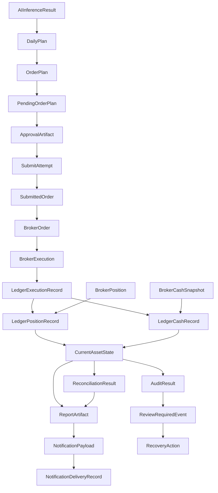

# Phase13-F Runtime Data Model Design

作成日: 2026-07-07

判定: DESIGN_ONLY

## 1. 目的

Runtime v2 が管理するデータモデルを定義する。

Current State Contract の詳細設計に進む前に、以下を整理する。

- Runtime が管理する主要 Object
- 各 Object の役割
- 各 Object の関係性
- Current / History / Evidence / Derived / External / Transitional の分類
- Runtime Component との対応
- 保存先 Path 候補
- 一意キー
- 参照キー
- ライフサイクル
- 禁止する参照関係
- schema 詳細設計へ渡す未決事項

Phase13-F はデータモデル設計のみである。実装変更、Submit、Broker 注文、Demo / Production 注文、通知送信、`launchd` 再開、既存 plist 削除、新規 plist 作成は行わない。

## 2. 前提

Runtime Architecture v2 の原則を必ず守る。

- Runtime は AI 判断ロジックではなく運用制御層である。
- Current / History / Derived を分離する。
- Runtime Current は固定 Path で管理する。
- Phase 番号は Runtime 実行時 SoT ではない。
- 日付は履歴属性であり、Runtime 実行対象の主キーではない。
- 注文と約定を混同しない。
- 注文は資産ではない。
- 約定して初めて保有になる。
- `submitted_orders` / `broker_orders` は現在保有 SoT ではない。
- `persistent_ledger/state.json` が現在資産状態の中心である。
- Report は Derived であり、Runtime Current 入力ではない。
- Runtime は銘柄数固定上限を持たない。
- 既存 Runtime 制御は v2 正規フローとして継承しない。

## 3. Runtime Object 定義

分類:

- Current: Runtime が固定 Path から現在状態として読む。
- History: 実行履歴。
- Evidence: 監査、照合、説明に使う証跡。
- Derived: 人間向け表示、通知、説明用の派生成果物。
- External: Broker / market data source 由来の外部状態。
- Transitional: Current へ昇格する前、または履歴化される途中状態。

| Object | 役割 | 分類 | 所有 Component | 生成 Component | 読む Component | 保存先 Path 候補 | 一意キー | 参照キー | 主な fields | lifecycle state | 保持期間 / 履歴化方針 | Current 入力可 | Submit 対象可 | 現在保有 SoT 可 | 資産 SoT 可 | 注意事項 |
| --- | --- | --- | --- | --- | --- | --- | --- | --- | --- | --- | --- | --- | --- | --- | --- | --- |
| RuntimeRun | 1回の Runtime 実行単位 | Evidence | Runtime Orchestrator | Runtime Orchestrator | Audit, Report, Recovery | `runtime_state/runs/YYYY-MM-DD/` | `run_id` | `runtime_id`, `business_date` | mode, started_at, ended_at, status | CREATED, RUNNING, COMPLETED, BLOCKED, HALT | run history として保持 | 参照のみ | いいえ | いいえ | いいえ | Phase 番号を実行 SoT にしない |
| RuntimeState | Runtime State Machine の現在状態 | Current | Runtime State Machine Runtime | Runtime Orchestrator | All components | `runtime_state/current_state.json` | `runtime_id` | `run_id`, `business_date` | state, last_transition, blocked_reason, review_required | IDLE, APPROVED, SUBMITTING, REVIEW_REQUIRED, HALT など | Current snapshot + transition history | はい | いいえ | いいえ | いいえ | 保有・現金を重複保持しない |
| CurrentStateReadResult | Current 読み取り結果と unknown flags | Current / Evidence | Current State Runtime | Current State Runtime | Planning, Approval, Submit, Report, Audit | `runtime_state/current_state_read_result.json` または run manifest | `run_id` | `runtime_id` | state_missing, current_positions_unknown, cash_unknown, buying_power_unknown | READ_OK, STATE_UNKNOWN, STALE, REVIEW_REQUIRED | run evidence として保持 | はい | いいえ | いいえ | いいえ | unknown を保有0扱いしない |
| MarketDataSnapshot | 市場データ取得結果 | History / External | Market Data Runtime | Market Data Runtime | Feature, AI, Report | `market_refresh/YYYY-MM-DD/` | `business_date` + source hash | business_date | source, universe, fetched_at, data_hash | READY, STALE, FAILED | 日付別履歴 | いいえ | いいえ | いいえ | いいえ | 投資判断ではない |
| FeatureSnapshot | AI 用特徴量 snapshot | History | Feature Runtime | Feature Runtime | AI Execution, Planning | `feature_refresh/YYYY-MM-DD/`, `feature_artifacts/YYYY-MM-DD/` | feature_snapshot_id | business_date, data_hash | feature_set, generated_at, universe | READY, STALE, FAILED | 日付別履歴 | いいえ | いいえ | いいえ | いいえ | Current asset state を更新しない |
| AIInferenceResult | AI 実行結果の親 object | History / Evidence | AI Execution Runtime | AI Execution Runtime | Planning, Report, Audit | `ai_inference/YYYY-MM-DD/` | ai_inference_id | feature_snapshot_id, run_id | candidate, opportunity, position, allocation, safety refs | GENERATED, BLOCKED, REVIEW_REQUIRED | evidence として保持 | いいえ | いいえ | いいえ | いいえ | Runtime は AI logic を再実装しない |
| CandidateResult | 購入候補 | History / Evidence | AI Execution Runtime | Candidate AI via AI Execution Runtime | Opportunity, Planning, Report | `ai_inference/YYYY-MM-DD/candidate_result.json` | candidate_result_id | ai_inference_id | symbols, scores, reasons | GENERATED | evidence として保持 | いいえ | いいえ | いいえ | いいえ | 銘柄数固定上限は Runtime 側で持たない |
| OpportunityRanking | 候補順位 | History / Evidence | AI Execution Runtime | Opportunity AI via AI Execution Runtime | Planning, Report | `ai_inference/YYYY-MM-DD/opportunity_ranking.json` | opportunity_ranking_id | candidate_result_id | ranked_symbols, priorities | GENERATED | evidence として保持 | いいえ | いいえ | いいえ | いいえ | Runtime が恣意的に順位変更しない |
| PositionDecision | 保有判断 | History / Evidence | AI Execution Runtime | Position Management AI via AI Execution Runtime | Planning, Report | `ai_inference/YYYY-MM-DD/position_decision.json` | position_decision_id | current_asset_state_id | hold, sell, reduce, add reasons | GENERATED | evidence として保持 | いいえ | いいえ | いいえ | いいえ | 現在保有 SoT ではない |
| CapitalAllocationResult | 資金配分結果 | History / Evidence | AI Execution Runtime | Capital Allocation via AI Execution Runtime | Planning, Approval, Report | `ai_inference/YYYY-MM-DD/capital_allocation.json` | allocation_id | ai_inference_id, current_asset_state_id | target_amounts, cash_constraints | GENERATED | evidence として保持 | いいえ | いいえ | いいえ | いいえ | 結果として銘柄数が絞られることはある |
| SafetyDecision | Safety 判断結果 | History / Evidence | Safety Runtime | Safety via AI Execution Runtime | Planning, Approval, Submit, Audit | `safety_result/YYYY-MM-DD/` | safety_decision_id | run_id, plan_id | allowed, blocked, review_required, reasons | ALLOW, BLOCK, REVIEW_REQUIRED | evidence として保持 | 参照のみ | いいえ | いいえ | いいえ | Safety logic を Runtime に再実装しない |
| DailyPlan | 日次計画 | History / Evidence | Planning Runtime | Planning Runtime | Report, Audit | `daily_plan/YYYY-MM-DD/` | plan_id | ai_inference_id, current_asset_state_id | candidates, actions, constraints | CREATED, BLOCKED | History として保持 | いいえ | いいえ | いいえ | いいえ | Submit 対象ではない |
| OrderPlan | 注文計画 history | History / Evidence | Planning Runtime | Planning Runtime | Approval, Report, Audit | `order_plan/YYYY-MM-DD/` | order_plan_id | plan_id, source hashes | proposed_orders, quantities, notional | CREATED, SUPERSEDED, BLOCKED | History として保持 | いいえ | いいえ | いいえ | いいえ | 直接 Submit 禁止 |
| PendingOrderPlan | Current Submit 候補 | Current | Planning / Approval / Submit Runtime | Planning Runtime | Approval, Submit, Report, Audit | `pending_order_plan/pending_order_plan.json` | `pending_plan_id` | order_plan_id, approval_id | state, items, intended_submit_date, target_session_date | PENDING_APPROVAL, APPROVED, SUBMITTING, SUBMITTED, CONSUMED, EXPIRED, BLOCKED, REVIEW_REQUIRED | Current。消費後は archive / history | はい | はい、唯一 | いいえ | いいえ | Submit 唯一の source |
| PendingOrderItem | Pending 内の個別注文候補 | Current | Planning / Submit Runtime | Planning Runtime | Approval, Submit, Report | embedded in pending plan | `pending_item_id` | pending_plan_id, symbol | side, qty, limit, notional, constraints | PENDING, APPROVED, BLOCKED, SUBMITTED, REVIEW_REQUIRED | pending lifecycle に従う | はい | pending 経由のみ | いいえ | いいえ | item 単体を日付別から復元しない |
| ApprovalRequest | 承認依頼 | History / Evidence | Approval Runtime | Approval Runtime | Approval, Report | `approval_request/YYYY-MM-DD/` | approval_request_id | pending_plan_id, order_plan_hash | requested_items, policy, expires_at | CREATED, SENT, BLOCKED | History として保持 | いいえ | いいえ | いいえ | いいえ | raw secret 保存禁止 |
| ApprovalArtifact | 承認証跡 | History / Evidence | Approval Runtime | Approval Runtime | Submit, Report, Audit | `approval_artifact/YYYY-MM-DD/` | `approval_id` | pending_plan_id, source_order_plan_hash | status, approved_item_ids, approval_hash | APPROVED, REJECTED, EXPIRED, REVIEW_REQUIRED | Evidence として保持 | いいえ | 直接は不可 | いいえ | いいえ | Submit 対象推測に使わない |
| SubmitAttempt | Submit 試行 | History / Evidence / Transitional | Submit Runtime | Submit Runtime | Ledger, Reconcile, Report, Recovery | `submitted_orders/YYYY-MM-DD/submit_attempt.json` | `submit_attempt_id` | pending_plan_id, run_id | state, started_at, preflight_result | PREPARED, SENDING, SENT, ACCEPTED, REJECTED, POST_SEND_UNKNOWN, BLOCKED, REVIEW_REQUIRED | Evidence として保持 | いいえ | いいえ | いいえ | いいえ | POST_SEND_UNKNOWN は自動再送禁止 |
| SubmittedOrder | 送信済み注文履歴 | History / Evidence | Submit Runtime | Submit Runtime | Broker, Ledger, Fill, Report | `submitted_orders/YYYY-MM-DD/` | `submitted_order_id` | submit_attempt_id, pending_item_id | side, qty, order_hash, broker_order_ref_hash | SUBMITTED, ACCEPTED, BLOCKED, REVIEW_REQUIRED | History として保持 | いいえ | いいえ | いいえ | いいえ | 現在保有 SoT ではない |
| BrokerOrder | Broker 注文状態 | External / Evidence | Broker Runtime | Broker Runtime | Fill, Ledger, Reconcile | `broker_orders/YYYY-MM-DD/` | `broker_order_ref_hash` | submitted_order_id | status, qty, filled_qty, remaining_qty | UNKNOWN, ACCEPTED, PARTIALLY_FILLED, FILLED, CANCELLED, EXPIRED, REJECTED | Evidence として保持 | 直接不可 | いいえ | Production では不可 | 不可 | 注文状態であり保有ではない |
| BrokerExecution | Broker 約定 | External / Evidence | Broker Runtime | Broker Runtime | Fill, Ledger, Asset | `broker_executions/YYYY-MM-DD/` | `broker_execution_ref_hash` | broker_order_ref_hash | symbol, side, qty, price, executed_at | REPORTED, DUPLICATE, REVIEW_REQUIRED | Evidence。Ledger ingestion 対象 | 直接不可 | いいえ | 根拠にはなる | 直接不可 | 約定根拠。raw id は hash |
| BrokerPosition | Broker 保有 snapshot | External / Evidence | Broker Runtime | Broker Runtime | Ledger, Asset, Reconcile | `broker_positions/YYYY-MM-DD/` | broker_position_snapshot_id | business_date, source | positions, qty, market_value | REPORTED, STALE, REVIEW_REQUIRED | Evidence。Ledger ingestion 対象 | 直接不可 | いいえ | 根拠にはなる | 直接不可 | 保有確認根拠 |
| BrokerCashSnapshot | Broker 現金 / 買付余力 | External / Evidence | Broker Runtime | Broker Runtime | Ledger, Asset, Reconcile | `broker_cash/YYYY-MM-DD/` | `cash_snapshot_key` | business_date, source | cash, buying_power, currency | REPORTED, STALE, REVIEW_REQUIRED | Evidence。Ledger ingestion 対象 | 直接不可 | いいえ | いいえ | 根拠にはなる | cash state へ正規化する |
| ExecutionEvent | 約定関連 event | Current / Evidence | Execution / Fill Runtime | Execution / Fill Runtime | Ledger, Reconcile, Report | `persistent_ledger/events.jsonl` | event_id | execution_key, submitted_order_id | event_type, classification, review_required | CREATED, DEDUPED, REVIEW_REQUIRED | append-only | はい | いいえ | いいえ | いいえ | 二重反映防止に使う |
| FillClassification | Fill 分類 | Evidence | Execution / Fill Runtime | Execution / Fill Runtime | Ledger, Report, Recovery | `fill_events/YYYY-MM-DD/` or events | fill_classification_id | broker_order_ref_hash, execution_key | NO_FILL, PARTIAL_FILL, FULL_FILL, UNKNOWN_FILL | NO_FILL, PARTIAL_FILL, FULL_FILL, DUPLICATE_IGNORED, UNKNOWN_FILL, REVIEW_REQUIRED | Evidence として保持 | いいえ | いいえ | いいえ | いいえ | 注文受付と約定を分ける |
| LedgerOrderRecord | 正規化注文 record | Current | Ledger Runtime | Submit / Ledger Runtime | Ledger, Reconcile, Report, Audit | `persistent_ledger/orders.jsonl` | `ledger_record_id` | submitted_order_id, broker_order_ref_hash | normalized order, source, env, review_required | APPENDED, DEDUPED, REVIEW_REQUIRED | append-only | はい | いいえ | いいえ | いいえ | 注文 ledger。保有ではない |
| LedgerExecutionRecord | 正規化約定 record | Current | Ledger Runtime | Ledger Runtime | Asset, Reconcile, Report | `persistent_ledger/executions.jsonl` | `ledger_record_id` | `execution_key`, broker_execution_ref_hash | symbol, side, qty, price, executed_at | APPENDED, DEDUPED, REVIEW_REQUIRED | append-only | はい | いいえ | 根拠 | 根拠 | 約定二重反映を防ぐ |
| LedgerPositionRecord | 正規化保有 record | Current | Ledger Runtime | Ledger Runtime | Asset, Planning, Report | `persistent_ledger/positions.jsonl` | `ledger_record_id` | `position_key`, execution_key | symbol, qty, avg_price, source | APPENDED, SUPERSEDED, REVIEW_REQUIRED | append-only + latest projection | はい | いいえ | はい | 根拠 | CurrentAssetState の材料 |
| LedgerCashRecord | 正規化現金 record | Current | Ledger Runtime | Ledger Runtime | Asset, Planning, Report | `persistent_ledger/cash_history.jsonl` | `ledger_record_id` | cash_snapshot_key | cash, buying_power, currency, source | APPENDED, SUPERSEDED, REVIEW_REQUIRED | append-only + latest projection | はい | いいえ | いいえ | 根拠 | CurrentAssetState の材料 |
| LedgerEventRecord | Runtime / review / migration event | Current | Ledger Runtime | Any Runtime Component via Ledger | Audit, Recovery, Report | `persistent_ledger/events.jsonl` | event_id | run_id, object ids | type, severity, review_required, message | APPENDED, RESOLVED, UNRESOLVED | append-only | はい | いいえ | いいえ | いいえ | raw response / secret 保存禁止 |
| CurrentAssetState | 現在資産状態 | Current | Asset / Ledger Runtime | Asset Runtime | Planning, Approval, Report, Audit | `persistent_ledger/state.json` | `asset_state_id` | position_key, cash_snapshot_key | positions, cash, buying_power, market_value, total_equity | UNKNOWN, CONFIRMED_EMPTY, CONFIRMED, STALE, REVIEW_REQUIRED, DIVERGED | Current snapshot + source history | はい | いいえ | はい | はい | 現在資産 SoT の中心 |
| ReconciliationResult | 照合結果 | History / Evidence | Reconcile Runtime | Reconcile Runtime | Report, Audit, Recovery | `reconciliation_result/YYYY-MM-DD/` | reconciliation_id | asset_state_id, pending_plan_id | broker_divergence, ledger_divergence, reasons | PASS, REVIEW_REQUIRED, DIVERGED | History として保持 | いいえ | いいえ | いいえ | いいえ | Current 決定元にしない |
| ReportArtifact | Report 出力 | Derived | Report Runtime | Report Runtime | Human, Notification, Audit | `reports/YYYY-MM-DD/` | `report_id` | asset_state_id, reconciliation_id | public_report, internal_report, safety_report | GENERATED, STALE, REVIEW_REQUIRED | Derived として保持 | いいえ | いいえ | いいえ | いいえ | Runtime Current 入力にしない |
| NotificationPayload | 通知 payload | Derived | Notification Runtime | Report / Notification Runtime | Notification Runtime | `notifications/YYYY-MM-DD/` | `payload_hash` | report_id | channel, body, target_date | CREATED, READY_TO_SEND, SUPERSEDED | Derived として保持 | いいえ | いいえ | いいえ | いいえ | 送信 dedup は DeliveryRecord |
| NotificationDeliveryRecord | 通知送信 ledger | Current | Notification Runtime | Notification Runtime | Notification, Audit, Recovery | `notification_delivery/delivery_ledger.jsonl` | `delivery_id` | payload_hash, channel, target_date | sent_at, status, retry_allowed, review_required | PAYLOAD_CREATED, READY_TO_SEND, SENDING, SENT, FAILED, POST_SEND_UNKNOWN, REVIEW_REQUIRED | append-only | はい | いいえ | いいえ | いいえ | 同一 payload_hash / channel / target_date を二重送信しない |
| AuditResult | 監査結果 | History / Evidence / Derived | Audit Runtime | Audit Runtime | Recovery, Report | `audit_result/YYYY-MM-DD/` | audit_id | run_id, asset_state_id | findings, severity, review_required | PASS, FINDINGS, REVIEW_REQUIRED | Evidence として保持 | いいえ | いいえ | いいえ | いいえ | Submit 対象選択元にしない |
| ReviewRequiredEvent | Review required event | Current / Evidence | Recovery / Review Runtime | Any component via Ledger | Recovery, Report, Audit | `persistent_ledger/events.jsonl` | `review_event_id` | object id, run_id | reason, severity, status | OPEN, ACKED, RESOLVED, UNRESOLVED | append-only | はい | いいえ | いいえ | いいえ | 人間確認が必要 |
| RecoveryAction | 復旧 action record | Evidence | Recovery / Review Runtime | Recovery / Review Runtime | Audit, Report | `recovery/YYYY-MM-DD/` or events | recovery_action_id | review_event_id | action_type, operator, result | PROPOSED, APPLIED, REJECTED | Evidence として保持 | いいえ | いいえ | いいえ | いいえ | 自動再 Submit 禁止 |
| MigrationRecord | Migration record | History / Evidence / Current if append ledger | Migration Runtime | Migration Runtime | Ledger, Audit, Recovery | `persistent_ledger/migrations.jsonl` | `migration_id` | source artifact ids | source, target, status, review_required | PROPOSED, DRY_RUN, APPLIED, REJECTED | append-only | migration ledger のみ可 | いいえ | いいえ | いいえ | 破壊的削除ではなく補正記録 |

## 4. Object 関係図



関係の原則:

- BrokerOrder は注文状態であり、現在保有ではない。
- BrokerExecution は約定根拠である。
- BrokerPosition は保有確認根拠である。
- CurrentAssetState は約定・保有・現金を反映した現在資産状態である。
- ReportArtifact は CurrentAssetState から生成される Derived であり、Current 入力ではない。

## 5. Current / History / Derived / External 分類

### Current

- RuntimeState
- CurrentStateReadResult
- PendingOrderPlan
- PendingOrderItem
- LedgerOrderRecord
- LedgerExecutionRecord
- LedgerPositionRecord
- LedgerCashRecord
- LedgerEventRecord
- CurrentAssetState
- NotificationDeliveryRecord
- ReviewRequiredEvent

### History / Evidence

- RuntimeRun
- MarketDataSnapshot
- FeatureSnapshot
- AIInferenceResult
- CandidateResult
- OpportunityRanking
- PositionDecision
- CapitalAllocationResult
- SafetyDecision
- DailyPlan
- OrderPlan
- ApprovalRequest
- ApprovalArtifact
- SubmitAttempt
- SubmittedOrder
- BrokerOrder
- BrokerExecution
- BrokerPosition
- BrokerCashSnapshot
- FillClassification
- ReconciliationResult
- AuditResult
- RecoveryAction
- MigrationRecord

### Derived

- ReportArtifact
- NotificationPayload
- BlogDraft
- LinePayload
- DiscordPayload

### External

- BrokerOrder
- BrokerExecution
- BrokerPosition
- BrokerCashSnapshot
- MarketDataSnapshot

外部 Broker 由来データは、直接 Current にしない。Ledger Runtime が正規化・反映した後に CurrentAssetState へ反映する。

## 6. Key 設計

| Key | 用途 | 主な所有 Object | 原則 |
| --- | --- | --- | --- |
| `runtime_id` | Runtime 系統識別 | RuntimeState, RuntimeRun | Phase 番号ではない |
| `run_id` | 1回の実行識別 | RuntimeRun, RuntimeState | 再実行入口判断に使う |
| `business_date` | 履歴属性 | many history artifacts | Current 選択キーにしない |
| `target_session_date` | 注文対象営業日 | PendingOrderPlan, PendingOrderItem | Submit 対象日 guard に使う |
| `plan_id` | DailyPlan 識別 | DailyPlan | History 識別 |
| `order_plan_id` | OrderPlan 識別 | OrderPlan | Submit source ではない |
| `pending_plan_id` | PendingPlan 識別 | PendingOrderPlan | Submit 重複防止に使う |
| `pending_item_id` | Pending item 識別 | PendingOrderItem | item-level guard に使う |
| `approval_id` | 承認識別 | ApprovalArtifact | pending linkage に使う |
| `approval_hash` | 承認改ざん検知 | ApprovalArtifact, PendingOrderPlan | Submit preflight に使う |
| `source_order_plan_hash` | source plan 検証 | OrderPlan, PendingOrderPlan | History evidence 検証用 |
| `submit_attempt_id` | Submit 試行識別 | SubmitAttempt | POST_SEND_UNKNOWN 追跡 |
| `submitted_order_id` | 送信済み注文識別 | SubmittedOrder | 保有 SoT ではない |
| `broker_order_ref_hash` | Broker order 参照 hash | BrokerOrder, SubmittedOrder | raw id 保存禁止 |
| `broker_execution_ref_hash` | Broker execution 参照 hash | BrokerExecution | raw id 保存禁止 |
| `execution_key` | 約定 dedup | LedgerExecutionRecord | 約定二重反映防止 |
| `ledger_record_id` | Ledger record 識別 | Ledger records | append-only record key |
| `position_key` | position 識別 | LedgerPositionRecord | symbol / account scope / source |
| `cash_snapshot_key` | cash snapshot 識別 | BrokerCashSnapshot, LedgerCashRecord | cash 二重反映防止 |
| `asset_state_id` | current asset snapshot 識別 | CurrentAssetState | state projection 識別 |
| `report_id` | Report 識別 | ReportArtifact | Derived 識別 |
| `payload_hash` | notification payload dedup | NotificationPayload, DeliveryRecord | 通知二重送信防止 |
| `delivery_id` | delivery record 識別 | NotificationDeliveryRecord | delivery ledger key |
| `review_event_id` | review event 識別 | ReviewRequiredEvent | recovery tracking |
| `migration_id` | migration 識別 | MigrationRecord | migration audit |

重要原則:

- 日付だけを Current 選択キーにしない。
- `business_date` は履歴属性として使う。
- `target_session_date` は注文対象営業日として使う。
- `pending_plan_id` は Submit 重複防止に使う。
- `execution_key` は約定二重反映防止に使う。
- `payload_hash` は通知二重送信防止に使う。
- broker raw id は保存せず、必要なら hash 化する。

## 7. Lifecycle 設計

### PendingOrderPlan lifecycle

```text
PENDING_APPROVAL
APPROVED
SUBMITTING
SUBMITTED
CONSUMED
EXPIRED
BLOCKED
REVIEW_REQUIRED
```

`CONSUMED` は再 Submit 不可。`POST_SEND_UNKNOWN` 経路では自動再送せず Review / Broker ReadOnly へ進める。

### SubmitAttempt lifecycle

```text
PREPARED
SENDING
SENT
ACCEPTED
REJECTED
POST_SEND_UNKNOWN
BLOCKED
REVIEW_REQUIRED
```

`SENDING` 以降は非冪等。結果不明時に自動再送しない。

### BrokerOrder lifecycle

```text
UNKNOWN
ACCEPTED
PARTIALLY_FILLED
FILLED
CANCELLED
EXPIRED
REJECTED
```

BrokerOrder は注文状態であり、現在保有 SoT ではない。

### Execution / Fill lifecycle

```text
NO_FILL
PARTIAL_FILL
FULL_FILL
DUPLICATE_IGNORED
UNKNOWN_FILL
REVIEW_REQUIRED
```

約定が確認されて初めて position / cash へ反映する。

### CurrentAssetState lifecycle

```text
UNKNOWN
CONFIRMED_EMPTY
CONFIRMED
STALE
REVIEW_REQUIRED
DIVERGED
```

`UNKNOWN` を保有 0 として扱わない。`CONFIRMED_EMPTY` の厳密条件は Phase13-G Current State Contract で定義する。

### NotificationDelivery lifecycle

```text
PAYLOAD_CREATED
READY_TO_SEND
SENDING
SENT
FAILED
POST_SEND_UNKNOWN
REVIEW_REQUIRED
```

Notification Send は非冪等。Delivery Ledger で二重送信を防ぐ。

## 8. 禁止する参照関係

- OrderPlan から直接 Submit しない。
- ApprovalArtifact から直接 Submit 対象を推測しない。
- SubmittedOrder を現在保有 SoT にしない。
- BrokerOrder を Production 現在保有 SoT にしない。
- ReportArtifact を Runtime Current 入力にしない。
- NotificationPayload を Runtime Current 入力にしない。
- History artifact から最新らしい Current を推測しない。
- 日付別ディレクトリを Current 選択元にしない。
- Phase 番号を Current 選択元にしない。
- Broker raw response を保存しない。
- secret / session / URL / 口座識別子を保存しない。

## 9. Component との対応

| Component | 生成 / 更新する Runtime Object |
| --- | --- |
| Runtime Orchestrator | RuntimeRun, RuntimeState |
| Current State Runtime | CurrentStateReadResult |
| Market Data Runtime | MarketDataSnapshot |
| Feature Runtime | FeatureSnapshot |
| AI Execution Runtime | AIInferenceResult, CandidateResult, OpportunityRanking, PositionDecision, CapitalAllocationResult, SafetyDecision |
| Planning Runtime | DailyPlan, OrderPlan, PendingOrderPlan candidate, PendingOrderItem |
| Approval Runtime | ApprovalRequest, ApprovalArtifact, Pending approval linkage |
| Submit Runtime | SubmitAttempt, SubmittedOrder, LedgerOrderRecord |
| Broker Runtime | BrokerOrder, BrokerExecution, BrokerPosition, BrokerCashSnapshot |
| Execution / Fill Runtime | FillClassification, ExecutionEvent |
| Ledger Runtime | LedgerOrderRecord, LedgerExecutionRecord, LedgerPositionRecord, LedgerCashRecord, LedgerEventRecord, CurrentAssetState |
| Asset Runtime | CurrentAssetState |
| Reconcile Runtime | ReconciliationResult |
| Report Runtime | ReportArtifact, NotificationPayload candidate |
| Notification Runtime | NotificationPayload, NotificationDeliveryRecord |
| Audit Runtime | AuditResult |
| Recovery / Review Runtime | ReviewRequiredEvent, RecoveryAction |
| Migration Runtime | MigrationRecord |

## 10. Directory Layout 案

Current fixed paths:

```text
runtime_state/current_state.json
pending_order_plan/pending_order_plan.json
persistent_ledger/state.json
persistent_ledger/orders.jsonl
persistent_ledger/executions.jsonl
persistent_ledger/positions.jsonl
persistent_ledger/cash_history.jsonl
persistent_ledger/events.jsonl
persistent_ledger/migrations.jsonl
notification_delivery/delivery_ledger.jsonl
```

History / Evidence paths:

```text
order_plan/YYYY-MM-DD/
approval_artifact/YYYY-MM-DD/
submitted_orders/YYYY-MM-DD/
broker_orders/YYYY-MM-DD/
broker_executions/YYYY-MM-DD/
broker_positions/YYYY-MM-DD/
broker_cash/YYYY-MM-DD/
reconciliation_result/YYYY-MM-DD/
audit_result/YYYY-MM-DD/
recovery/YYYY-MM-DD/
```

Derived paths:

```text
reports/YYYY-MM-DD/
daily_report_refs/YYYY-MM-DD/
notifications/YYYY-MM-DD/
```

Directory 原則:

- Current は固定 Path。
- History / Evidence / Derived は日付別で保持してよい。
- 日付別 Path は Current 選択元にしない。
- Phase13 用 Path は Runtime Current にしない。

## 11. Current State Contract へ渡す未決事項

Phase13-G Current State Contract 詳細設計へ渡す事項:

- 各 Current Object の `schema_version`
- required fields
- optional fields
- validation rules
- missing 判定
- stale 判定
- unknown 判定
- confirmed empty 判定
- dedup key 設計
- append-only record policy
- snapshot 生成 policy
- Current State read API
- Current State write API
- Current State architecture tests

## 12. 禁止事項

Phase13-F では以下を禁止する。

- 実装変更
- Submit 実行
- Broker 注文
- Demo 注文
- Production 注文
- `launchd` 再開
- 既存 plist 削除
- 新規 plist 作成
- artifact 削除
- notification 送信
- AI 再学習
- フルバックテスト

## 13. 完了条件

- Runtime Data Model 設計書が作成されている。
- 主要 Runtime Object が定義されている。
- 各 Object の役割・分類・所有 Component・保存先・一意キー・参照キーが整理されている。
- Object 関係図が作成されている。
- Current / History / Derived / External の分類が整理されている。
- 禁止する参照関係が明記されている。
- Component との対応が整理されている。
- Directory Layout 案が整理されている。
- Current State Contract へ渡す未決事項が整理されている。
- JSON レポートが作成され、妥当性確認されている。
- 実装変更が一切行われていない。

