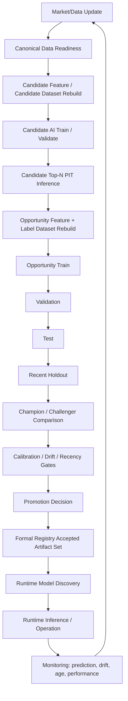

# Phase17-BV19 AI Training Lifecycle and Retraining Pipeline Audit

## Executive Summary

Phase17-BV19 audited the AI update lifecycle for AI Fund Lab v2 with focus on Opportunity AI. This was an audit-only phase. No training, retraining, dataset rebuild, Registry update, Runtime change, model switch, Runtime Test, `.runtime` edit, J-Quants fetch, broker write, order submit, or notification was executed.

Final classifications:

```text
TRAINING_PIPELINE_PARTIAL
AUTO_RETRAIN_NOT_READY
REGISTRY_PARTIAL
MODEL_LIFECYCLE_INCOMPLETE
DATASET_PIPELINE_BLOCKED
REVIEW_REQUIRED
```

Root cause:

```text
Opportunity AI stale issue is caused by a partial/manual training lifecycle: Phase5/Phase9 contain dataset/training/audit building blocks, and Runtime can consume an accepted model set, but the repository does not contain a complete automated pipeline that refreshes Candidate/Opportunity PIT training data, trains challengers, validates, applies recency/drift gates, writes formal Registry acceptance evidence, and safely switches Runtime to a promoted model.
```

The formal Runtime Opportunity model is an accepted Registry artifact set, but it is not automatically refreshed. The formal model uses Phase5P artifacts created on `2026-06-14T01:22:38+00:00`; its Runtime-compatible training dataset ends at `2026-05-15`. Local quote data exists beyond that (`2026-07-14` in the operations raw-normalized store and `2026-06-26` in the Phase9 canonical store), but no current Opportunity dataset builder artifact extends Phase5P's formal 32-feature candidate/opportunity dataset after `2026-05-15`.

## AI Lifecycle Diagram



Current implementation status:

```text
Data update -> Runtime feature refresh exists for daily inference.
Opportunity dataset rebuild -> partial Phase5/Phase9 tools exist, not current automated formal pipeline.
Train/validation/test -> phase scripts exist; BV18 challenger run was ad hoc/evidence-only.
Recent holdout/champion-challenger -> analysis exists, not formal reusable promotion gate.
Promotion -> formal Registry acceptance tooling exists, but no automated model-promotion pipeline.
Runtime switch -> Registry lookup exists and fail-closes, but no automatic retrain selection.
Monitoring/retrain loop -> design/evidence only; no operational recency/drift gate enforcement.
```

## Implementation Status Matrix

| Component | Status | Evidence |
| --- | --- | --- |
| Dataset Builder | `PARTIAL_IMPLEMENTED` | `src/ai_fund_lab_v2/opportunity_ai/dataset_builder.py` builds Phase5-D dataset from supplied candidate/feature/label paths. It does not fetch/update data or orchestrate Candidate rebuild. |
| Candidate Dataset Builder | `PARTIAL_IMPLEMENTED` | Phase4/Phase9 builders exist; Phase9-L1 creates broad candidate/opportunity dataset candidates, but not the Phase5P 32-feature Opportunity formal dataset. |
| Opportunity Dataset Builder | `PARTIAL_IMPLEMENTED` | Phase5-D/5-I/5-P builders exist. Current formal Phase5P artifact stops at `2026-05-15`. |
| Training Runner | `IMPLEMENTED_MANUAL` | `scripts/train_phase5e_opportunity_model.py` and `train_opportunity_model()` train from a provided parquet path. |
| Validation Runner | `PARTIAL_IMPLEMENTED` | Phase5 quality/combined validation and BV18 challenger validation exist; not unified into a promotion gate. |
| Test Split | `IMPLEMENTED_STATIC` | Phase5-E uses dataset split column; Phase5-D split thresholds are fixed by date. |
| Recent Holdout | `MANUAL_ANALYSIS` | BV18 created holdout evidence; no reusable production gate. |
| Promotion Decision | `PARTIAL_MANUAL` | Artifact acceptance contract and writer exist; Opportunity model promotion is not automated and must be authority-gated. |
| Registry Update | `IMPLEMENTED_MANUAL_ACCEPTANCE` | Phase16-AT accepted `ai.opportunity.accepted_set`; Registry event/index resolver works. No retrain-to-registry automated path. |
| Weekly Retrain | `NOT_IMPLEMENTED_FOR_RUNTIME_V2` | Phase9 adopted `WEEKLY_RETRAIN_DAILY_INFERENCE` as policy direction; no current Runtime v2 weekly retrain job found. |
| Monthly Retrain | `NOT_IMPLEMENTED` | Historical candidate builder can sample monthly/weekly/all, but no formal monthly retrain lifecycle. |
| Recency Gate | `DESIGNED_NOT_IMPLEMENTED` | BV18 proposed a recency gate; BV17 found no Registry recency gate evidence. |
| Model Age Monitoring | `DESIGNED_NOT_IMPLEMENTED` | BV17/BV18 measured age in audit; Runtime does not enforce model age. |
| Feature Drift | `PARTIAL_AUDIT_ONLY` | BV17/BV18 compare feature/candidate distributions; no production gate. |
| Prediction Drift | `PARTIAL_AUDIT_ONLY` | BV16 all-negative analysis and BV18 alarms are evidence/design only. |
| Calibration Evaluation | `PARTIAL_MANUAL` | Phase5-J and BV18 compare calibration; no accepted calibrator pipeline. |
| Rollback | `REGISTRY_CONTRACT_ONLY` | Artifact acceptance supports accepted/legacy/revoked concepts; no AI model rollback operator pipeline was found. |
| Champion/Challenger Comparison | `MANUAL_ANALYSIS` | BV18 implemented ad hoc challenger comparison in reports only. |
| Artifact Save | `IMPLEMENTED` | Models/metrics and Registry artifact set members are hash-addressed. |
| Version Management | `PARTIAL` | `MODEL_VERSION = opportunity_model_phase5e_v1`; no automatic version bump/promotion workflow. |

## Can It Auto-Update On 2026-07-17?

No.

If the operator added latest data on `2026-07-17`, the repository does not provide a single complete, production-safe command that runs:

```text
dataset rebuild -> train -> validation -> test -> recent holdout -> promotion decision
```

without manual intervention.

Manual or missing steps:

- Provide or rebuild Candidate AI full-history features and candidate Top50 rows compatible with Opportunity AI.
- Generate 20-business-day labels only through the label-safe cutoff.
- Rebuild the Phase5P 32-feature Opportunity dataset after `2026-05-15`.
- Choose time-series split windows and recent holdout boundaries.
- Train champion/challenger candidates under a new versioned output root.
- Compare champion/challenger metrics and calibration.
- Check BV14/BV15 BUY eligibility impact on Runtime PIT candidate distributions.
- Create formal model, metrics, feature schema, training metadata, lineage, validation, and consumer compatibility members.
- Run formal acceptance/regression gates.
- Write an authority-approved Registry `ARTIFACT_ACCEPTED` event and rebuild materialized index/checkpoint.
- Switch Runtime only through Registry authority; no path edit or metrics fallback.

## Dataset Update Audit

Observed artifact date ranges:

| Artifact | Rows | Feature Columns | Label Columns | Min Date | Max Date |
| --- | ---: | ---: | ---: | --- | --- |
| `reports/opportunity_ai/phase5d/opportunity_dataset.parquet` | 2,846 | 16 | 14 | 2021-09-30 | 2026-05-15 |
| `reports/opportunity_ai/phase5i/full_history_opportunity_dataset.parquet` | 56,995 | 16 | 14 | 2021-09-08 | 2026-05-15 |
| `reports/opportunity_ai/phase5p/opportunity_dataset_with_market_sector.parquet` | 56,995 | 32 | 14 | 2021-09-08 | 2026-05-15 |
| `.runtime/phase9/training_dataset_candidates/2026-05-18/opportunity_ai_dataset.parquet` | 4,974,436 | 6 | 4 | 2021-06-14 | 2026-05-18 |
| `.runtime/operations/jquants/raw_normalized/jquants/equities_bars_daily/data.parquet` | 426,689 | 0 | 0 | 2026-02-16 | 2026-07-14 |
| `.runtime/phase9/canonical_data/normalized_daily_quotes/data.parquet` | 5,108,552 | 0 | 0 | 2021-06-14 | 2026-06-26 |

Why the formal Opportunity dataset stops at `2026-05-15`:

- Phase5-D already warned that Phase4 Candidate Top50 latest was `2026-06-12` while the Phase4 label table was only available through `2026-05-15`; join coverage would block without overlapping candidate/feature/label rows.
- Phase5-I and Phase5-P reused that full-history Opportunity dataset lineage. Phase5-P adds market/sector features to the existing baseline dataset target dates rather than extending label-safe dates.
- Phase9-L1 later produced broad dataset candidates through `2026-05-18`, but those have a different 6-feature/4-label schema and are not the accepted 32-feature Opportunity Runtime contract.
- BV18 confirmed local raw quotes could support a later label-safe feature date (`2026-06-16` from local quotes), but no continuous Runtime-compatible Opportunity training rows after `2026-05-15` existed.

Classification:

```text
pipeline未実装
手動運用
古いartifact利用
Candidate側/label側/formal Opportunity dataset rebuild未接続
監視不足
```

Not classified as provider data absence: local quote stores contain later data. Not classified as Runtime feature drift: BV16/BV17 confirmed Runtime feature schema connection was valid.

## Weekly Retrain Requirement Check

Phase9 completion states:

```text
WEEKLY_RETRAIN_DAILY_INFERENCE
```

was adopted as the initial retrain mode, with daily data update / feature generation / inference required and retraining controlled by policy.

Implementation reality:

- `src/ai_fund_lab_v2/paper_trading/daily_inference_runner.py` records `retrain_mode = WEEKLY_RETRAIN_DAILY_INFERENCE`.
- Phase9-K concluded Candidate/Opportunity retrain was required.
- Phase9-L1 produced safe training dataset candidates and explicitly did not retrain.
- `ops/scheduler` contains templates only and does not auto-register scheduler jobs.
- Runtime v2 launchd jobs call Runtime operation jobs, not AI retraining jobs.
- BV17 found no weekly retrain evidence and no Registry recency gate evidence.
- BV18 created a recommended weekly retrain design but did not implement it.

Conclusion:

```text
Requirement/design exists.
Runtime v2 production-grade implementation is absent.
```

## Promotion Audit

Promotion contract:

- Runtime-use requires `ACCEPTED`, `runtime_use_eligible=true`, hash match, schema match, source refs, and consumer compatibility.
- Runtime/AI/CLI must not self-promote to `ACCEPTED`.

Current Opportunity accepted set:

- logical artifact set: `ai.opportunity.accepted_set`
- set type: `OPPORTUNITY_AI_SET`
- accepted at: `2026-07-13T20:40:53.473430+00:00`
- accepted event: `event-2a6f1c25-a73c-450c-b607-50f8149f4ba1-9a53a9c0660d13ea`
- runtime_use_eligible: `true`
- model hash: `140e350bd9b12bf0c595184587fa2a3bd74236e4bdf1818df481022980dd6acd`
- metrics hash: `8428f2327e77374743f69e2ebc956a97a9d718880ef2acfc26571f94d9fd9511`

What is missing:

- no retrain-to-Registry operator pipeline
- no automated promotion decision gate
- no formal challenger packaging command
- no recency gate attached to acceptance eligibility
- no model-age enforcement before Runtime use

## Runtime Model Selection

Runtime Opportunity model discovery is fail-closed and Registry-based:

- `produce_buy_ai_decisions()` calls `resolve_buy_ai_artifact_paths()`.
- `resolve_buy_ai_artifact_paths()` resolves `CANDIDATE_AI_SET` and `OPPORTUNITY_AI_SET`.
- Opportunity requires roles: `MODEL`, `METRICS`, `FEATURE_SCHEMA`, `TRAINING_METADATA`, `TRAINING_DATA_LINEAGE`, `VALIDATION_EVIDENCE`, `CONSUMER_COMPATIBILITY`.
- model and metrics must come from the same artifact set.
- diagnostic CLI paths cannot override Registry authority.
- Phase5-E metrics path is explicitly prohibited.

Fallback status:

```text
Silent fallback is prohibited in Runtime v2.
The remaining gap is not model selection integrity; it is model lifecycle freshness and retrain/promotion automation.
```

## Drift Detection Audit

| Drift / Freshness Area | Status | Evidence |
| --- | --- | --- |
| Feature Drift | `PARTIAL_AUDIT_ONLY` | BV17/BV18 compare distributions; no production halt/review gate. |
| Prediction Drift | `PARTIAL_AUDIT_ONLY` | BV16 all-negative diagnosis; BV18 proposed alarms. |
| Calibration Drift | `PARTIAL_AUDIT_ONLY` | Phase5-J/BV18 calibration studies; no accepted calibrator or drift monitor. |
| Positive Rate Drift | `DESIGNED_NOT_IMPLEMENTED` | BV18 proposes all-negative/positive-rate alarms. |
| Model Age | `DESIGNED_NOT_IMPLEMENTED` | BV17/BV18 calculate staleness; Runtime does not enforce. |
| Data Freshness | `IMPLEMENTED_FOR_RUNTIME_MARKET_FEATURES` | Runtime data readiness checks market/feature artifacts. |
| Dataset Freshness | `NOT_IMPLEMENTED` | No gate blocks accepted model because training dataset max date is old. |

## AI Responsibility Matrix

| AI | Learning Method | Update Method | Timing | Update Responsibility | Runtime Responsibility |
| --- | --- | --- | --- | --- | --- |
| Candidate AI | Supervised model from market features/labels; Phase4 formal model. | Phase4/Phase9 tooling exists; formal auto-retrain not complete. | Intended daily inference, policy-controlled retrain. | Candidate training/acceptance pipeline. | Generate Candidate decisions through accepted model set; Runtime does not reimplement scoring. |
| Opportunity AI | Supervised expected-edge regression/ranking from Candidate Top50 + market/sector features. | Phase5 scripts and BV18 challenger analysis exist; no complete auto retrain/promotion. | Intended daily inference with weekly retrain policy, not implemented as Runtime v2 lifecycle. | Opportunity training/validation/acceptance pipeline. | Resolve accepted Opportunity set, validate model/metrics/schema, produce rankings and BUY eligibility evidence. |
| Position Management AI | Rule/code-policy style PM adapter, not external sklearn model in current Runtime. | Registry accepted current path/code-policy refresh. | Runtime sell planning per business day. | PM code-policy/adapter acceptance. | Produce SELL/HOLD decisions from Current and feature artifacts; fail closed on registry or feature mismatch. |
| Safety AI / Safety | Safety/policy authority, mostly guard/rule/evidence contract rather than trainable model. | Safety policy/evidence refresh, not AI retrain. | Each readiness/planning/submit boundary. | Safety authority/policy owner. | Consume Safety authority; never bypass fail-closed conditions. |

## Root Cause

The Opportunity AI stale problem is not a Runtime wiring problem and not a feature schema drift problem. Runtime consumes the accepted artifact set correctly. The stale problem comes from missing lifecycle automation around the model:

```text
Pipeline未実装
手動更新前提
Phase未完了
設計不足
監視不足
```

Supporting facts:

- Formal model training dataset max date: `2026-05-15`.
- Formal training created at: `2026-06-14T01:22:38+00:00`.
- Local data extends later than the formal dataset.
- Phase9-K declared retrain required.
- Phase9-L1 prepared dataset candidates but did not retrain.
- BV17 found no weekly retrain or Registry recency gate evidence.
- BV18 showed challengers can improve Runtime score distribution but are not promotion-ready.

## Acceptance / Final Judgment

```text
TRAINING_PIPELINE_PARTIAL
AUTO_RETRAIN_NOT_READY
REGISTRY_PARTIAL
MODEL_LIFECYCLE_INCOMPLETE
DATASET_PIPELINE_BLOCKED
REVIEW_REQUIRED
```

## Files Inspected

- `docs/phase_reports/phase17_bv16_opportunity_expected_edge_semantics_and_runtime_distribution_investigation.md`
- `docs/phase_reports/phase17_bv17_opportunity_formal_model_revalidation_and_calibration_root_cause_investigation.md`
- `docs/phase_reports/phase17_bv18_opportunity_pit_retraining_challenger_validation_and_promotion_readiness.md`
- `docs/03_ai_design/opportunity_ai_design.md`
- `docs/03_ai_design/candidate_training_data_design.md`
- `docs/phase_reports/phase5d_opportunity_dataset_builder.md`
- `docs/phase_reports/phase5e_opportunity_training.md`
- `docs/phase_reports/phase5p_market_sector_feature_completion.md`
- `docs/phase_reports/phase9k_model_manifest_retrain_eligibility.md`
- `docs/phase_reports/phase9l1_retrain_safety_plan.md`
- `docs/phase_reports/phase9l1_training_dataset_safety_audit.md`
- `docs/phase_reports/phase9_completion_audit_and_phase10_handoff.md`
- `docs/phase_reports/phase16_k_ai_artifact_registry_and_capital_allocation_design.md`
- `src/ai_fund_lab_v2/opportunity_ai/dataset_builder.py`
- `src/ai_fund_lab_v2/opportunity_ai/training.py`
- `src/ai_fund_lab_v2/opportunity_ai/full_history_expansion.py`
- `src/ai_fund_lab_v2/opportunity_ai/market_sector_completion.py`
- `src/ai_fund_lab_v2/runtime_v2/buy_ai/producer.py`
- `src/ai_fund_lab_v2/runtime_v2/artifact_lookup.py`
- `src/ai_fund_lab_v2/artifact_registry/resolver.py`
- `src/ai_fund_lab_v2/paper_trading/training_dataset_candidate.py`
- `.runtime/artifact_registry/index/registry_index.json`
- `.runtime/artifact_registry/events/registry_events.jsonl`

## Commands Executed

Read-only/source-inspection and evidence-writing commands only:

- `rg` searches for retrain, weekly, promotion, recency, drift, Opportunity, Registry.
- `sed` inspections of architecture, phase reports, scripts, and source files.
- Python read-only parquet/json inventory for existing artifact date ranges and Registry metadata.
- `find` inventory of Opportunity artifacts and Registry files.

No prohibited operation was executed.

## Prohibited Operations Confirmation

The following were not executed:

- train / retrain
- dataset rebuild
- Registry update or refresh
- Runtime model switch
- Runtime code change
- Runtime Test run / resume / reset / rollback / close
- `.runtime` manual edit
- J-Quants fetch
- broker write
- order submit
- external notification
